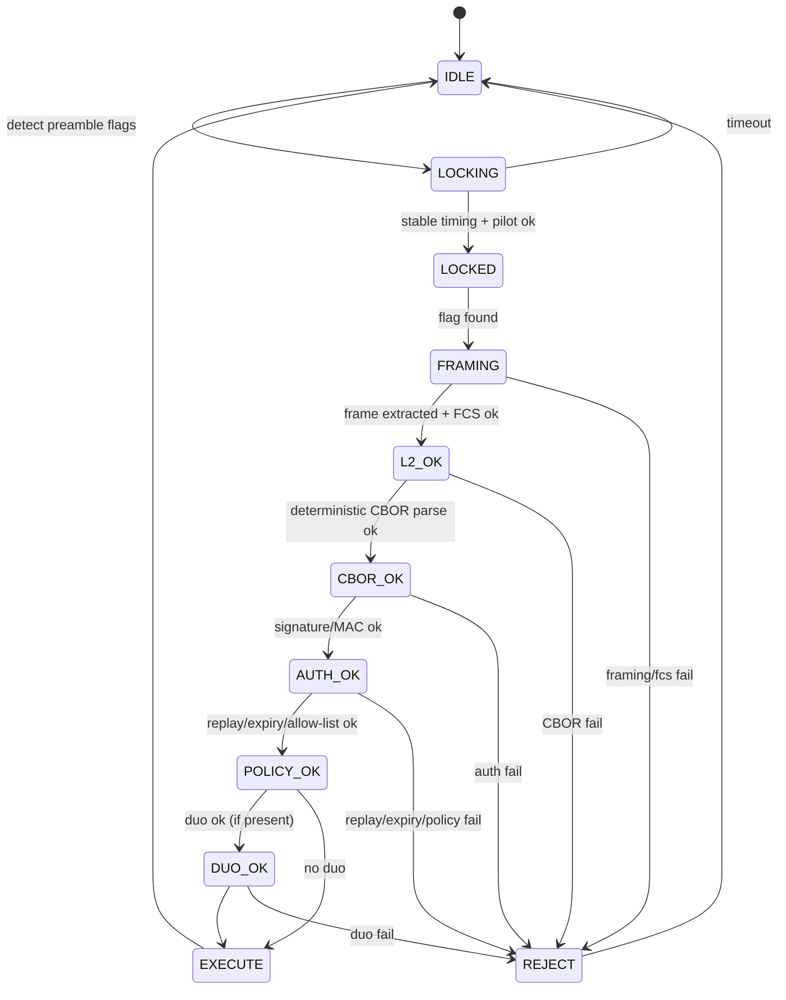

```markdown
---
title: "OWAC-MQP: One-Way Audio Control & Media Queue Protocol"
subtitle: "Unified Specification (Architecture + Duotronics Symbol Layer + v0.2 Implementable Freeze)"
doc_id: "OWAC-MQP-UNIFIED"
spec_version: "0.2.1-draft"
protocol_version: 1
date: "2026-02-19"
status: "Draft (implementable, with frozen PHY/L2/CBOR/Auth profiles)"
---

# Preface

OWAC-MQP is a **unidirectional** control protocol intended to let an **air-gapped control workstation** send **authenticated, replay-resistant, fail-closed** control messages to an **internet-facing media server** over a simple **analog audio cable** (line-out → line-in). The design **does not** attempt confidentiality. Its primary security posture is:

- **Authenticity-first acceptance** (nothing state-changing executes unless cryptographic verification passes),
- **Deterministic parsing** (no ambiguity, no “best effort” interpretation),
- **Replay resistance without acknowledgements** (receiver-enforced),
- **Reject-by-default** under uncertainty,
- **High observability** (tamper/interference becomes visible via logs/metrics/alerts).

This unified document consolidates:
1) the architecture and threat-driven requirements,  
2) the **Duotronics** polygon-based symbol/representation layer (canonicalized and signed), and  
3) the **v0.2 implementable addendum** that freezes PHY/L2 constants, deterministic CBOR, authenticity profiles, replay rules, and a golden test-vector pipeline that starts at raw PCM audio.

---

# Table of Contents

- [1. Notation and Conventions](#1-notation-and-conventions)
- [2. System Model](#2-system-model)
- [3. Threat Model and Security Goals](#3-threat-model-and-security-goals)
- [4. Protocol Stack Overview](#4-protocol-stack-overview)
- [5. Physical Layer (Frozen Profile OWAC-PHY-AUD-A)](#5-physical-layer-frozen-profile-owacphy-aud-a)
- [6. Modem and Link Layer (Frozen)](#6-modem-and-link-layer-frozen)
- [7. Link Health and Observability (Normative)](#7-link-health-and-observability-normative)
- [8. Message Layer (Deterministic CBOR, Frozen)](#8-message-layer-deterministic-cbor-frozen)
- [9. Authenticity and Keying Profiles (PQ + Optional OTMAC)](#9-authenticity-and-keying-profiles-pq--optional-otmac)
- [10. Replay Resistance, Execute-Once, and Persistence](#10-replay-resistance-executeonce-and-persistence)
- [11. Application Layer: Allow-Listed Command Set](#11-application-layer-allowlisted-command-set)
- [12. Duotronics Symbol Layer (Normative)](#12-duotronics-symbol-layer-normative)
- [13. Song-Driven Control (Optional Extension)](#13-songdriven-control-optional-extension)
- [14. Bulk Transfer over Audio (Optional, Quarantined)](#14-bulk-transfer-over-audio-optional-quarantined)
- [15. Conformance, Golden Vectors, and Test Strategy](#15-conformance-golden-vectors-and-test-strategy)
- [16. Environmental / EMI Qualification Guidance](#16-environmental--emi-qualification-guidance)
- [17. Registries and Extension Points](#17-registries-and-extension-points)
- [Appendix A: Receiver Pipeline State Machine](#appendix-a-receiver-pipeline-state-machine)
- [Appendix B: Deterministic CBOR CDDL (Normative)](#appendix-b-deterministic-cbor-cddl-normative)
- [Appendix C: CRC/FCS Reference Algorithm (PPP FCS-16)](#appendix-c-crcfcs-reference-algorithm-ppp-fcs16)
- [Appendix D: Duotronics Canonicalization Reference Pseudocode](#appendix-d-duotronics-canonicalization-reference-pseudocode)
- [Appendix E: Reject Reasons (Normative Codes)](#appendix-e-reject-reasons-normative-codes)
- [Appendix F: Worked End-to-End Example](#appendix-f-worked-endtoend-example)
- [References](#references)

---

# 1. Notation and Conventions

## 1.1 RFC 2119 Terms

The key words **MUST**, **MUST NOT**, **REQUIRED**, **SHALL**, **SHALL NOT**, **SHOULD**, **SHOULD NOT**, **RECOMMENDED**, **MAY**, and **OPTIONAL** are to be interpreted as described in RFC 2119.

## 1.2 Normative vs Informative

- **Normative** sections define required behavior and interoperability constraints.
- **Informative** sections provide rationale, guidance, and optional patterns.

## 1.3 “Fail-Closed” Rule (Global)

If any validation gate fails at any layer, the receiver **MUST**:
1) reject the message (no state change), and  
2) emit observable evidence (structured log event and metric increment), and  
3) include a **specific reject reason code** (Appendix E).

---

# 2. System Model

## 2.1 Nodes

- **ACN (Air-Gapped Control Node):** operator workstation; no internet access; transmits only via analog line-out.
- **IMN (Internet-Facing Media Node):** server; receives audio via line-in; performs decode → verify → allow-list execute.

## 2.2 Trust Boundaries

- The audio cable is treated as a **unidirectional “diode-like” path**.
- There is **no** protocol acknowledgement or return channel.

## 2.3 Design Assumptions

- Physical access may be contested (EMI/injection possible).
- Availability under jamming is **not required**, but **tamper/interference must be observable**.

---

# 3. Threat Model and Security Goals

## 3.1 Threats Considered

The receiver must assume:
- EMI/RF coupling into cable or audio front-end (distortion, clipping, tone injection).
- Direct audio injection (electrical coupling, near-field, conducted).
- Replay of previously captured valid transmissions.
- Jamming (denial of service).
- Parser ambiguity exploitation (inconsistent canonicalization / encoding).

## 3.2 Non-Goals

- Confidentiality of commands.
- Robust operation under continuous active jamming.
- Remote administration of IMN over the same audio channel.

## 3.3 Security Goals

- **G1: Deterministic Parse:** one on-wire payload → exactly one transcript or reject.
- **G2: Authenticated Execution:** state changes only after authenticity verification.
- **G3: Replay Resistance:** receiver-enforced monotonic acceptance.
- **G4: Fail-Closed Under Uncertainty:** reject ambiguous/invalid input.
- **G5: Observability:** interference/tamper becomes visible.

---

# 4. Protocol Stack Overview

OWAC-MQP is layered:

1) **PHY**: analog audio profile (sampling, levels, pilot)  
2) **Modem**: AFSK demod + NRZI bit recovery  
3) **L2**: HDLC-like framing + bit stuffing + CRC/FCS  
4) **L3 Message**: deterministic CBOR envelope + size limits  
5) **Auth**: PQ signature (default) or optional one-time MAC family  
6) **Replay/Policy gates**: strict counters, expiry, allow-lists  
7) **Application**: media queue / transport / bounded “text intent” only  
8) **Duotronics (symbol layer)**: canonical representation inside the signed transcript

Mermaid overview:

```mermaid
flowchart TD
  A[PCM audio in] --> B[AFSK demod + NRZI]
  B --> C[HDLC-like framing\n+ unstuffing + FCS]
  C --> D[CBOR decode\n(deterministic rules)]
  D --> E[TranscriptBytes recompute\n(message minus auth)]
  E --> F[Verify signature/MAC]
  F --> G[Replay + expiry + policy gates]
  G --> H[Duotronics canonicalization (if present)]
  H --> I[Allow-listed command execution]
  C -->|FCS fail| X[Reject + log/metrics]
  F -->|auth fail| X
  G -->|replay/expiry/policy fail| X
  H -->|duo fail| X
```

---

# 5. Physical Layer (Frozen Profile OWAC-PHY-AUD-A)

## 5.1 Audio Capture/Playback Format (Normative)

* Sample rate: **48,000 Hz**
* Channels: **mono**
* Sample format: **16-bit signed PCM**
* Golden test vectors **MUST** use exactly this format.

## 5.2 Physical Interconnect (Normative Options)

### 5.2.1 High-Assurance Interconnect (RECOMMENDED)

* Balanced line level (e.g., XLR or equivalent) with **galvanic isolation transformer** at least at IMN input.

### 5.2.2 Development / Low-Assurance

* Unbalanced line-out/line-in MAY be used, but all monitoring and reject rules still apply.

## 5.3 Amplitude and Clipping Policy (Normative)

IMN **MUST** compute:

* clipped sample count per second,
* RMS level per 100 ms window,
* near-silence detection (configurable threshold).

If clipping exceeds a configured threshold in any window that overlaps a candidate frame, IMN **MUST** set `link_suspect=true` and include it in the audit event.

## 5.4 Pilot Tone (OWAC-PILOT-19K) (Normative for Profile OWAC-PHY-AUD-A)

* A 19.000 kHz sine pilot **SHALL** be mixed into the transmitted signal at **−30 dBFS RMS** relative to the payload RMS.
* IMN **SHALL** continuously track pilot amplitude and phase stability.
* Abrupt pilot loss, saturation, or large excursions **MUST** produce:

  * metric increment (`owac_link_pilot_fault_total`),
  * structured log event,
  * `link_suspect=true` annotation on any overlapping command decisions.

> Note: If specific deployed audio hardware rolls off 19 kHz, define a hardware-specific profile ID rather than weakening acceptance logic.

---

# 6. Modem and Link Layer (Frozen)

## 6.1 Modulation: OWAC-AFSK-1200 (Normative)

* Baud rate: **1200**
* Mark (logic 1): **1200 Hz**
* Space (logic 0): **2200 Hz**
* Initial tone state at start of burst: **Mark**

## 6.2 Line Coding: NRZI (Normative)

NRZI mapping:

* Data bit **0** ⇒ **transition** (toggle between mark/space)
* Data bit **1** ⇒ **no transition**

## 6.3 Bit and Byte Ordering (Normative)

* Bits are assembled into octets **LSB-first** on the physical bitstream.
* The HDLC flag 0x7E corresponds to bit sequence `01111110` (LSB-first transmission implies wire order conventions must be frozen; implementers MUST follow the conformance vectors for exact behavior).

## 6.4 Framing: HDLC-Like Envelope (Normative)

### 6.4.1 Flag and Preamble

* Frame delimiter (flag): **0x7E**
* Preamble: transmitter **SHALL** send **≥ 32** consecutive flags before each burst.

### 6.4.2 Bit Stuffing (Transparency)

* Between opening and closing flags, transmitter inserts a **0 bit** after any run of **five (5) consecutive 1 bits**.
* Receiver removes any **0 bit** that immediately follows five consecutive 1 bits.
* Stuffing applies across **payload + FCS** bits (everything between flags).

### 6.4.3 Frame Extraction Rules

Receiver **MUST** reject (no partial interpretation):

* frames not bounded by flags,
* frames that do not decode into whole octets after unstuffing,
* empty frames (back-to-back flags) are ignored (not counted as errors).

## 6.5 FCS/CRC: PPP FCS-16 (Normative)

Freeze the exact parameters:

* Polynomial (normal form): **x^16 + x^12 + x^5 + 1**
* Reflected representation: **0x8408**
* Initial value: **0xFFFF**
* Final check (“good” value after including received FCS): **0xF0B8**
* Transmit FCS bytes: **LSB first** (low byte, then high byte)
* Computation: compute over frame bytes (excluding flags), ones-complement, append.

(Reference algorithm in Appendix C.)

## 6.6 FEC Profiles and Ordering (Normative if used, Frozen)

FEC is **availability-oriented**. It **MUST NOT** replace cryptographic authentication.

FEC behavior is determined solely by `profile` (no negotiation).

**6.6.1 Common Baseline (No FEC) — Profile 1**

For `profile=1 (OWAC-PHY-AUD-A)`:

TX order (between bursts):

1. Construct `MsgBytes` (deterministic CBOR)
2. Form L2 frame bytes: `FrameBytes = MsgBytes || FCS16(FrameBytes)`
3. Convert to bits LSB-first
4. Apply HDLC bit stuffing across **FrameBytes+FCS bits**
5. Apply NRZI line coding
6. AFSK modulate
7. Add flags: preamble flags + opening flag + stuffed NRZI-coded body + closing flag
   (flags are not part of the stuffed body)

RX is the exact inverse: detect flags → NRZI decode → unstuff → octetize → verify FCS → extract CBOR.

**6.6.2 Reed–Solomon + Interleave — Profile 2**

For `profile=2 (OWAC-PHY-AUD-A-FEC-RS16I2)`:

Reed–Solomon is **octet-domain** and is applied **before** bit stuffing.

TX order:

1. Construct `MsgBytes`
2. Form L2 base bytes: `BaseBytes = MsgBytes || FCS16(BaseBytes)`
3. Apply RS(255,223) with interleaving depth I=2 over `BaseBytes` to produce `FecBytes`
   (exact chunking and padding rules below)
4. Convert `FecBytes` to bits LSB-first
5. Apply HDLC bit stuffing across **FecBytes bits**
6. Apply NRZI
7. AFSK modulate and add flags as in 6.6.1

RX order:

1. Detect flags and extract body
2. NRZI decode
3. HDLC unstuff
4. Octetize to recover `FecBytes`
5. RS de-interleave and decode to recover `BaseBytes` (or reject)
6. Verify FCS on recovered `BaseBytes`
7. Extract `MsgBytes`

**RS Chunking / Padding (Frozen):**

* `BaseBytes` is segmented into blocks of **223 bytes**.
* The final block is padded with **0x00** bytes to 223 bytes.
* Each 223-byte block is encoded into a 255-byte RS codeword.
* Interleaving depth I=2 is applied across codewords in transmission order.
* The receiver discards pad bytes after RS decode by using the decoded length implied by the CBOR item length inside `MsgBytes`; if CBOR length is inconsistent ⇒ reject `REJ_CBOR_PARSE`.

**6.6.3 Convolutional Code (Rate 1/2) — Profile 3**

For `profile=3 (OWAC-PHY-AUD-A-FEC-CC-1_2)`:

Convolutional coding is **bit-domain** and its ordering is frozen as:

TX order (between bursts):

1. Construct `MsgBytes`
2. Form L2 frame bytes: `FrameBytes = MsgBytes || FCS16(FrameBytes)`
3. Convert `FrameBytes` to bits LSB-first
4. Apply HDLC bit stuffing across those bits
5. Apply convolutional encode (rate 1/2, constraint length K=7, generators 171(octal),133(octal)) to produce encoded bits
6. Apply NRZI line coding
7. AFSK modulate and add flags as in 6.6.1

RX order:

1. Detect flags, extract body bits
2. NRZI decode
3. Viterbi decode (rate 1/2) to recover stuffed bits
4. HDLC unstuff
5. Octetize to recover `FrameBytes`
6. Verify FCS
7. Extract `MsgBytes`

> Any FEC profile not listed here **MUST** be assigned a distinct profile ID and its ordering frozen analogously.

---

# 7. Link Health and Observability (Normative)

IMN **MUST** expose:

## 7.1 Metrics (Minimum Set)

* `owac_link_lock_events_total{state=lock|unlock}`
* `owac_l2_frames_total{result=ok|fcs_fail|framing_fail}`
* `owac_auth_total{result=ok|fail|sig_len|kid_unknown}`
* `owac_replay_total{result=replay|duplicate|expired}`
* `owac_policy_total{result=allow|deny|unknown_cmd|bad_args}`
* `owac_link_pilot_fault_total`
* `owac_link_clipping_windows_total`

## 7.2 Structured Logs (Minimum Fields)

Every candidate frame decision **MUST** log:

* timestamp
* profile_id
* link health snapshot (`pilot_ok`, `clipping`, `rms`, `lock_state`)
* decision (`accept|reject|ignore`)
* reject reason code (Appendix E) if reject
* if accept: `(epoch,sid,ctr)`, command type, and a transcript hash

## 7.3 Alerts (Policy Guidance)

Operator alerting SHOULD be derived from:

* sustained pilot faults,
* spikes in FCS failures,
* spikes in auth failures,
* repeated replays/expired counters,
* sustained lock/unlock oscillation.

---

# 8. Message Layer (Deterministic CBOR, Frozen)

## 8.1 Deterministic CBOR Rules (Normative)

Messages are CBOR with **deterministic encoding**:

* Indefinite-length items **MUST NOT** appear.
* Map keys **MUST** be sorted by bytewise lexicographic order of their deterministic encodings.
* Floating point **SHOULD NOT** be used in signed content. If unavoidable, a quantization policy ID MUST be included and enforced.

## 8.2 Top-Level Message Envelope (Normative)

Top-level CBOR map with small unsigned integer keys:

| Key | Name      | Type | Required | Meaning                                        |
| --- | --------- | ---- | -------- | ---------------------------------------------- |
| 0   | `v`       | uint | yes      | Protocol version; MUST be 1                    |
| 1   | `profile` | uint | yes      | PHY/L2 profile ID                              |
| 2   | `mid`     | map  | yes      | Message identity + replay controls             |
| 3   | `cmd`     | map  | yes      | Typed command                                  |
| 4   | `auth`    | map  | yes      | Authenticity container                         |
| 5   | `meta`    | map  | no       | Optional metadata (not required for execution) |

Unknown keys ⇒ **REJECT**.

## 8.3 `mid` Structure (Normative)

`mid` is a CBOR map:

* `0`: `epoch` (uint64)
* `1`: `ctr` (uint64)
* `2`: `sid` (bstr, **16 bytes**)
* `3`: `exp` (uint, Unix seconds) OPTIONAL but RECOMMENDED

## 8.4 `cmd` Structure (Normative)

`cmd` is a CBOR map:

* `0`: `type` (uint) command enum
* `1`: `args` (map) type-specific
* `2`: `duo` (bstr) OPTIONAL Duotronics payload or catalog reference

Unknown `cmd.type` ⇒ **REJECT**.

## 8.5 Size Limits (Normative, Frozen)

All size limits below apply to the **CBOR message bytes as carried in L2 payload** (i.e., before HDLC framing overhead).

**8.5.1 Algorithm-Specific Whole-Message Limits**

Let `MsgBytes = DeterministicCBOR(OWAC_Message)` (the fully encoded message including `auth`).

IMN **MUST** enforce `len(MsgBytes) ≤ MAX_MSG_BYTES(auth.alg)` where:

| `auth.alg` | Name                  | `MAX_MSG_BYTES` |
|----------:|------------------------|----------------:|
| 1         | `ML-DSA-65`            | 4096            |
| 2         | `SLH-DSA-SHA2-128s`    | 12288           |
| 3         | `OTMAC-WC-v1`          | 4096            |

Exceeding the applicable limit ⇒ **REJECT** with `REJ_SIZE_LIMIT`.

> Rationale: `SLH-DSA-SHA2-128s` signatures are large; this limit is frozen to support “critical ops” without requiring fragmentation.

**8.5.2 Sub-structure Limits (Unchanged, Still Required)**

Additionally, IMN **MUST** enforce:

* `cmd.args` deterministic encoding: **≤ 1024 bytes**
* any `tstr`: **≤ 256 bytes**
* any `bstr` **except signature**: **≤ 2048 bytes**
* any `meta` map (if present): **≤ 512 bytes** (deterministically encoded)

Exceeding any limit ⇒ **REJECT** with `REJ_SIZE_LIMIT`.

## 8.6 Canonical Transcript Bytes (Normative, Frozen)

Let `OWAC_Message` be the received CBOR data model.

Define `AUTH_TBS` (“auth to-be-signed”) as the `auth` map with the signature/MAC bytes excluded:

`AUTH_TBS = { 0: alg, 1: kid, ?3: ctx }`  (i.e., `auth[2]` omitted)

Define `Message_TBS` as the message where key `4` (`auth`) is replaced by `AUTH_TBS`.

Then:

`TranscriptBytes = DeterministicCBOR(Message_TBS)`

Authenticity verification **MUST** be over `TranscriptBytes` (or a hash thereof, depending on algorithm profile).

---

# 9. Authenticity and Keying Profiles (PQ + Optional OTMAC)

## 9.1 Auth Container (Normative)

`auth` is a CBOR map:

* `0`: `alg` (uint) algorithm enum
* `1`: `kid` (bstr, 16 bytes) key identifier (receiver-pinned)
* `2`: `sig` (bstr) signature/MAC bytes
* `?3`: `ctx` (bstr, max 32 bytes) domain separation context (default empty)

Rules:

* Unknown `kid` ⇒ **REJECT**
* Signature length mismatch for the `alg` ⇒ **REJECT**
* `ctx` (if present) **MUST** be included in `TranscriptBytes` via Section 8.6, and thus is cryptographically bound.

If `meta[0]` is present (see Appendix B), it is an **echo** of `auth[3]=ctx` and:

* IMN **MUST** reject if `meta[0] != auth[3]` (bytewise mismatch), with `REJ_CTX_MISMATCH`.

## 9.2 PQ Signature Profiles (Normative Defaults)

OWAC defines two mandatory-to-implement verification modes at IMN:

* **ML-DSA-65** (default command signing)

  * Signature length: **3309 bytes**
  * Public key length: **1952 bytes**
* **SLH-DSA-SHA2-128s** (critical operations / epoch changes)

  * Signature length: **7856 bytes**

> Deployment may disable one, but the spec’s conformance suite assumes IMN can verify ML-DSA-65 at minimum.

## 9.3 Optional OTMAC (Information-Theoretic) Family (Optional)

An optional profile MAY support one-time universal-hash authentication (Wegman-Carter-style).

* One-time key reuse MUST be treated as catastrophic and MUST hard-fail (reject + alert).
* OTMAC is best used as a fast inner mechanism with PQ-signed epochs provisioning one-time key batches.

---

# 10. Replay Resistance, Execute-Once, and Persistence

## 10.1 Core Replay Rule (Normative, Frozen)

Per `(sid,kid)` pair, IMN maintains `(last_epoch, last_ctr)` in durable, rollback-resistant storage.

Define `E := mid.epoch` and `C := mid.ctr`.

Acceptance requires:

1) **Monotonicity:** `(E, C) > (last_epoch, last_ctr)` under lexicographic ordering, i.e.  
   * either `E > last_epoch`, OR  
   * `E == last_epoch` AND `C > last_ctr`

2) **Expiry (if present):** if `mid.exp` present then `now ≤ exp`

If accepted and released to execution, IMN **MUST** atomically persist:

`(last_epoch, last_ctr) := (E, C)`

**before** releasing the command to the actuator layer.

## 10.2 Duplicate Handling (Normative, Frozen)

Define `MID := (epoch, sid, ctr)`.

Per `(sid,kid)`, IMN **MUST** also retain the most recently accepted `transcript_hash` for `(last_epoch,last_ctr)`.

* If a message arrives with `epoch == last_epoch` AND `ctr == last_ctr` AND its `transcript_hash` equals the retained hash for that `(sid,kid)`, treat as **DUPLICATE**:
  * do not re-execute
  * log `duplicate=true`
  * increment `owac_replay_total{result=duplicate}`

* Any message for which `(epoch,ctr) < (last_epoch,last_ctr)` is **REPLAY** ⇒ reject `REJ_REPLAY`.

* Any message for which `(epoch,ctr) == (last_epoch,last_ctr)` but `transcript_hash` differs is **REPLAY** ⇒ reject `REJ_REPLAY` (this prevents ambiguous same-counter replays).

## 10.3 Quorum Mode (Optional, High-Assurance Reliability Gate)

IMN MAY be configured for **QUORUM** acceptance per MID:

* Require at least **K** independently decoded instances of the *same* TranscriptBytes within window **W** before execution.
* In QUORUM mode, IMN MUST NOT advance `last_ctr` until quorum is reached.

Recommended starting point: K=2, W=3 seconds, with ACN sending N=3 repeats spaced randomly over 1–2 seconds.

## 10.4 Rollback Resistance (Normative)

To prevent replay via state rollback:

* `last_ctr` storage MUST be rollback-resistant (write-ahead log + fsync at minimum; hardware monotonic counter if available).
* Any administrative reset that would allow re-use of counters **MUST** increment `mid.epoch` for subsequent commands and MUST be logged as a security event. IMN **MUST NOT** accept a command whose `(epoch,ctr)` is ≤ the persisted `(last_epoch,last_ctr)` for that `(sid,kid)`.

---

# 11. Application Layer: Allow-Listed Command Set

OWAC-MQP forbids “arbitrary OS remote control.” Commands are narrow, typed, bounded, and audited.

## 11.1 Command Type Registry (Normative Base Set)

`cmd.type` enum (uint):

* 0: `HEARTBEAT`
* 1: `QUEUE_TRACK`
* 2: `SUGGEST_TRACK`
* 3: `REMOVE_FROM_QUEUE`
* 10: `TRANSPORT_SET_STATE`
* 11: `TRANSPORT_SEEK`
* 12: `TRANSPORT_SET_RATE`
* 13: `TRANSPORT_NEXT`
* 14: `TRANSPORT_PREV`
* 20: `TEXT_INPUT`
* 30: `POLICY_EPOCH_UPDATE` (typically SLH-DSA signed)
* 31: `CATALOG_UPDATE` (typically SLH-DSA signed)

Unknown ⇒ reject.

## 11.2 Stable Identifiers Only (Normative)

* Media references MUST use stable IDs (`track_id`, `asset_id`) from an allow-listed catalog.
* URLs, arbitrary file paths, and arbitrary shell commands MUST NOT be accepted.

## 11.3 Per-Command Parameter Constraints (Normative)

### 11.3.1 HEARTBEAT

* args: `{}` or `{ t?: uint }` (optional coarse time)
* IMN logs missing heartbeats (policy-defined).

### 11.3.2 QUEUE_TRACK

Args:

* `track_id`: uint64 or bstr (catalog key)
* `priority_hint`: int in [-10..+10]
* `earliest_play_time`: uint (Unix seconds) OPTIONAL
* `latest_play_time`: uint (Unix seconds) OPTIONAL
  Rules:
* `latest_play_time` MUST be ≥ `earliest_play_time` if both present.
* `track_id` MUST exist in allow-listed catalog.

### 11.3.3 SUGGEST_TRACK

Args:

* `track_id`
* `weight_delta`: int in [-5..+5]
  Rate limiting:
* Per `(sid)` max suggestions per minute (configurable; default 12/min).

### 11.3.4 REMOVE_FROM_QUEUE

Args:

* `queue_item_id`: uint64
  Policy:
* RECOMMENDED to restrict removal to items enqueued by same `(sid)` unless explicitly authorized.

### 11.3.5 TRANSPORT_SET_STATE

Args:

* `state`: uint enum {0=stop,1=pause,2=play}

### 11.3.6 TRANSPORT_SEEK

Args:

* `delta_ms`: int in [-60_000..+60_000] by default

### 11.3.7 TRANSPORT_SET_RATE

Args:

* `rate`: int in [50..200] interpreted as percent (0.5×..2.0×)

### 11.3.8 TEXT_INPUT (Bounded “Text Intent”)

Args:

* `target`: uint enum (implementation allow-list), e.g. {0=SEARCH_BOX,1=TITLE_FIELD,2=MOD_PANEL}
* `mode`: uint enum {0=set,1=append,2=submit}
* `text`: tstr length ≤ 256 (policy may further restrict charset)
  Rules:
* IMN MUST NOT translate this into arbitrary OS keystrokes. It MUST apply only to allow-listed app fields.

---

# 12. Duotronics Symbol Layer (Normative)

Duotronics provides a deterministic representation layer whose outputs are **canonicalized and cryptographically bound** so the receiver never executes “interpretations,” only verified canonical transcripts.

## 12.1 Duotronics Objects and Policies (Normative)

A Duotronics “family” is defined by:

* polygon size `n ≥ 3`
* center weight `w_c` and vertex weights `w[0..n-1]`
* dot alphabet (baseline: {0,1})
* symmetry group policy `G ∈ {C_n, D_n}`
* canonicalization algorithm ID `canon_alg_id`
* label policy `label_policy_id` (offset/modulus rules)
* attachment policy (optional) `attach_policy_id`

These IDs MUST be explicit in the signed transcript if Duotronics is used.

## 12.2 Configuration Space (Baseline Dialect)

A configuration is:

* `c ∈ {0,1}` (center)
* `d[0..n-1] ∈ {0,1}^n` (vertex dots)
* optional attachments `a ∈ 𝒜` (must be deterministically transformable under symmetry)

## 12.3 Symmetry and Equivalence

* Rotation group: `C_n`
* Dihedral group: `D_n` (rotations + reflections)

Two configurations are equivalent if some `g ∈ G` maps one to the other.

## 12.4 Canonicalization (Normative)

Define `Can(x)` such that:

* idempotent: `Can(Can(x)) == Can(x)`
* invariant: for all `g ∈ G`, `Can(g·x) == Can(x)`
* total and deterministic

The reference algorithm enumerates all symmetry transforms and chooses lexicographically minimal rendering under a declared total order (Appendix D).

## 12.5 Descriptor Tuple (Normative Minimum)

When Duotronics is present, receiver MUST validate:

* `family_id` (known and allow-listed)
* `symmetry_policy_id`, `canon_alg_id`, `label_policy_id` (known)
* `Z_primary` matches recomputation
* `dot_count` matches recomputation
* `orbit_size` matches computed orbit size under declared `G`
* `canon_hash` matches hash of canonical transcript object (as defined by this spec)

If any mismatch ⇒ reject.

## 12.6 Degeneracy Handling (Normative)

If a coarse label (e.g., `Z_primary` alone) is known to be degenerate in the catalog:

* the message MUST carry sufficient fields (e.g., `canon_hash` or full canonical bits) to uniquely identify the intended entry,
* otherwise reject with `REJ_DUO_DEGENERATE`.

## 12.7 Duotronics in OWAC Messages (Normative)

`cmd[2] = duo` MAY contain one of:

### 12.7.1 Mode A: Direct Canonical Payload

A deterministic CBOR blob encoding:

* policy IDs
* canonicalized `(c, d_bits, attachments)`
* derived metrics

### 12.7.2 Mode B: Catalog Reference

A compact reference:

* `family_id`
* `canon_hash` (or catalog entry ID)
* minimal redundant checks (`Z_primary`, `dot_count`, `orbit_size`)

Both modes MUST be included in TranscriptBytes and thus authenticated.

---

# 13. Song-Driven Control (Optional Extension)

**Important:** Audio recognition of a song is not authentication. Therefore:

**Safe pattern (RECOMMENDED):**

1. Send an authenticated `QUEUE_TRACK(track_id=X)` command with expiry and counter.
2. Immediately play the full, unmodified audio of that track.
3. IMN executes the queue action only if:

   * the command verifies cryptographically,
   * the subsequent audio fingerprint matches `track_id=X` above a configured confidence threshold,
   * link health is not suspect beyond policy.

If recognition fails or is ambiguous ⇒ reject (no action), log `REJ_SONG_MISMATCH`.

---

# 14. Bulk Transfer over Audio (Optional, Quarantined)

Bulk transfer is OPTIONAL and should be treated as deliberately slow.

If enabled:

* data MUST be chunked (bounded chunk sizes),
* each chunk MUST have a hash,
* a final manifest MUST bind the transfer (content-addressed integrity),
* IMN MUST stage artifacts in **quarantine** and require explicit review prior to publication.

---

# 15. Conformance, Golden Vectors, and Test Strategy

## 15.1 Why Conformance Starts at PCM (Normative)

OWAC’s attack surface includes analog decode ambiguity. Therefore, conformance MUST begin with raw PCM.

## 15.2 Golden Vector Pack Layout (Normative)

```
owac-vectors/
  MANIFEST.json
  profiles/
    phy-aud-a/
      v0001_valid_heartbeat/
        audio.wav
        demod_bits.bin
        l2_frames.jsonl
        message.cbor
        transcript.cbor
        transcript.sha256
        auth.expected.json
      v0002_crc_fail/
      v0003_cbor_unsorted_keys/
      v0004_sig_fail/
      v0005_replay/
      v0006_duplicate/
      v0007_pilot_drop/
      v0008_clipping/
    phy-aud-a-fec-rs16i2/
      v0001_valid_heartbeat/
      v0002_fec_decode_fail/
    phy-aud-a-fec-cc-1_2/
      v0001_valid_heartbeat/
      v0002_fec_decode_fail/
```

MANIFEST.json MUST include:

* spec_version, profile_id,
* hash of every file.

## 15.3 Required Artifacts Per Vector (Normative)

* `audio.wav`: 48kHz mono PCM16
* `demod_bits.bin`: post-timing, pre-NRZI bit decisions
* `l2_frames.jsonl`: frame boundaries, unstuffed bytes, FCS result
* `message.cbor`: extracted CBOR bytes
* `transcript.cbor`: message without auth (deterministic CBOR)
* `transcript.sha256`: hash
* `auth.expected.json`: expected accept/reject and reason code

## 15.4 Negative Tests (Normative)

Pack MUST include at least:

* CBOR unsorted map keys ⇒ reject `REJ_CBOR_NOT_DET`
* Indefinite-length CBOR ⇒ reject `REJ_CBOR_INDEFINITE`
* Signature failure ⇒ reject `REJ_AUTH_FAIL`
* Replay (ctr <= last_ctr) ⇒ reject `REJ_REPLAY`
* Pilot drop during candidate frame ⇒ set `link_suspect` and reject if any gate fails; at minimum must log pilot fault
* Clipping injection ⇒ must log clipping and reject any malformed/unauth frames
* Message exceeds `MAX_MSG_BYTES(auth.alg)` ⇒ reject `REJ_SIZE_LIMIT` (include both an `alg=1` oversize and an `alg=2` oversize case)
* For each FEC profile, a vector where FEC decode fails, mapping to `REJ_L2_FRAMING` (with `fec_fail=true` logged)

## 15.5 Differential and Fuzz Testing (RECOMMENDED)

* Two independent implementations MUST match transcript hashes for the full vector pack.
* Fuzz CBOR and L2 payloads; ensure no crash and always reject with a reason code.

---

# 16. Environmental / EMI Qualification Guidance

If you want an “aerospace-grade” assurance posture, borrow the mindset:

* define environmental susceptibility tests for conducted/radiated noise on the audio link,
* demonstrate interference causes **reject + telemetry**, not accidental execution,
* qualify clipping, saturation, dropouts, burst noise, and lock oscillation conditions.

(Exact test standards and levels are deployment-specific; treat them as part of your assurance case.)

---

# 17. Registries and Extension Points

OWAC is versioned; extensions MUST be explicit.

## 17.1 Profile IDs (Initial Registry)

* 1: `OWAC-PHY-AUD-A` (AFSK-1200, pilot 19k, HDLC+FCS16)
* 2: `OWAC-PHY-AUD-A-FEC-RS16I2` (RS(255,223) + I=2 applied per §6.6.2)
* 3: `OWAC-PHY-AUD-A-FEC-CC-1_2` (convolutional rate 1/2 per §6.6.3)
* 1000+: reserved for ultrasonic profiles (must ship golden vectors)

## 17.2 Auth Algorithm IDs (Initial Registry)

* 1: `ML-DSA-65`
* 2: `SLH-DSA-SHA2-128s`
* 3: `OTMAC-WC-v1` (optional)

## 17.3 Canonicalization Algorithm IDs (Initial Registry)

* 1: `DUO_LEXMIN_ROT_V1`
* 2: `DUO_LEXMIN_DIHEDRAL_V1`

---

# Appendix A: Receiver Pipeline State Machine



---

# Appendix B: Deterministic CBOR CDDL (Normative)

> This CDDL expresses the data model. Deterministic encoding rules are normative requirements in Section 8.

```cddl
; OWAC-MQP protocol v=1

OWAC_Message = {
  0: uint,               ; v (MUST be 1)
  1: uint,               ; profile
  2: MID,                ; mid
  3: CMD,                ; cmd
  4: AUTH,               ; auth
  ? 5: META              ; meta (optional)
}

MID = {
  0: uint,               ; epoch (uint64)
  1: uint,               ; ctr   (uint64)
  2: bstr .size 16,      ; sid
  ? 3: uint              ; exp (unix seconds)
}

CMD = {
  0: uint,               ; type
  1: map,                ; args (type-specific)
  ? 2: bstr              ; duo (optional)
}

AUTH = {
  0: uint,               ; alg
  1: bstr .size 16,      ; kid
  2: bstr,               ; sig (length checked by alg)
  ? 3: bstr .size (0..32) ; ctx (domain separation), bound in TranscriptBytes
}

META = {
  ? 0: bstr .size (0..32) ; ctx echo (MUST equal AUTH[3] if both present)
}
```

---

# Appendix C: CRC/FCS Reference Algorithm (PPP FCS-16)

Pseudo-reference (table-driven variants allowed; must match golden vectors):

```text
POLY = 0x8408
INIT = 0xFFFF
GOOD = 0xF0B8

fcs = INIT
for each byte b in frame_bytes (excluding flags, excluding received FCS):
  fcs ^= b
  repeat 8 times:
    if (fcs & 1) == 1: fcs = (fcs >> 1) ^ POLY
    else:             fcs = (fcs >> 1)

fcs = ~fcs
append low byte then high byte
Receiver checks that running the same over payload+received_fcs yields GOOD.
```

---

# Appendix D: Duotronics Canonicalization Reference Pseudocode

```pseudo
function APPLY_ROTATION(d, t):
  return d_rot[k] = d[(k - t) mod n] for k in 0..n-1

function APPLY_REFLECTION(d):
  return d_ref[k] = d[(-k) mod n] for k in 0..n-1

function RENDER_FOR_COMPARE(c, d, a):
  ; MUST be deterministic and policy-versioned
  ; Recommended: deterministic CBOR encoding of {c, d_bits, a}
  return bytes

function CANONICALIZE(c, d, a, n, symmetry_policy):
  candidates = []

  for t in 0..n-1:
    candidates.append( (c, APPLY_ROTATION(d,t), TRANSFORM_ATTACH(a, rot=t)) )

  if symmetry_policy == "D_n":
    d_ref = APPLY_REFLECTION(d)
    a_ref = TRANSFORM_ATTACH(a, refl=true)
    for t in 0..n-1:
      candidates.append( (c, APPLY_ROTATION(d_ref,t), TRANSFORM_ATTACH(a_ref, rot=t)) )

  best = argmin candidates by RENDER_FOR_COMPARE
  orbit_size = count distinct RENDER_FOR_COMPARE among candidates

  return best, orbit_size
```

Hard gates (reject):

* unknown policy IDs
* descriptor mismatch (Z_primary, dot_count, orbit_size, canon_hash)
* degeneracy unresolved

---

# Appendix E: Reject Reasons (Normative Codes)

IMN MUST emit one of these codes on rejection:

## L1 / Link Health

* `REJ_LINK_NOLOCK`
* `REJ_LINK_PILOT_FAULT`
* `REJ_LINK_CLIP`

## L2 / Framing

* `REJ_L2_FRAMING`
* `REJ_L2_OCTET_ALIGN`
* `REJ_L2_FCS_FAIL`

## L3 / CBOR

* `REJ_CBOR_PARSE`
* `REJ_CBOR_NOT_DET`
* `REJ_CBOR_INDEFINITE`
* `REJ_SIZE_LIMIT`

## Auth

* `REJ_KID_UNKNOWN`
* `REJ_SIG_LEN`
* `REJ_AUTH_FAIL`

## Replay / Time

* `REJ_EXPIRED`
* `REJ_REPLAY`

## Policy / Application

* `REJ_UNKNOWN_CMD`
* `REJ_BAD_ARGS`
* `REJ_ALLOWLIST_DENY`
* `REJ_RATE_LIMIT`
* `REJ_CTX_MISMATCH`           ; added for meta/auth ctx mismatch

## Duotronics

* `REJ_DUO_POLICY_UNKNOWN`
* `REJ_DUO_CANON_FAIL`
* `REJ_DUO_DESCRIPTOR_MISMATCH`
* `REJ_DUO_DEGENERATE`

## Song extension

* `REJ_SONG_MISMATCH`

---

# Appendix F: Worked End-to-End Example

## F.1 HEARTBEAT (conceptual)

1. ACN constructs CBOR message:

* v=1, profile=1
* mid: epoch=7, ctr=105, sid=16B
* cmd: type=0, args={}
* meta: ctx="owac-mqp/v1"

2. TranscriptBytes = deterministic CBOR of message without `auth`
3. Sign TranscriptBytes with ML-DSA-65; put signature in `auth`
4. L2 frame = CBOR bytes (payload) + FCS
5. Modulate into AFSK burst + pilot + preamble flags

IMN pipeline:

* demod → framing → FCS ok → CBOR deterministic ok → transcript recompute → signature verify ok
* replay: ctr=105 > last_ctr → accept
* execute heartbeat: log presence; update last_ctr

## F.2 QUEUE_TRACK with Duotronics catalog reference

* cmd.type=1
* cmd.args: {track_id=73421, priority_hint=1}
* cmd.duo: {family_id="hex6_evenweights_v1", canon_hash=..., Z_primary=8, dot_count=3, orbit_size=6} (encoded as bstr)

IMN:

* verifies signature
* verifies replay
* verifies duo descriptor and degeneracy resolution
* performs allow-listed enqueue

---

# References

## Normative

* RFC 2119: Key words for use in RFCs to Indicate Requirement Levels
* RFC 8949: CBOR (Deterministic Encoding rules used here)
* CDDL (for expressing CBOR data models; publish the exact file with the spec)
* PPP HDLC-like framing and FCS-16 parameters (used for flag, bit-stuffing, and CRC freeze)
* NIST PQC standards: FIPS 204 (ML-DSA), FIPS 205 (SLH-DSA)

## Informative

* Unidirectional “data diode” design patterns (conceptual security model)
* Canonical labeling / canonicalization literature (for symmetry and canonical forms)
* Audio fingerprinting literature (for optional song-driven second factor)
* Environmental qualification frameworks (for EMI/robustness assurance mindset)

---

# End of Document
```