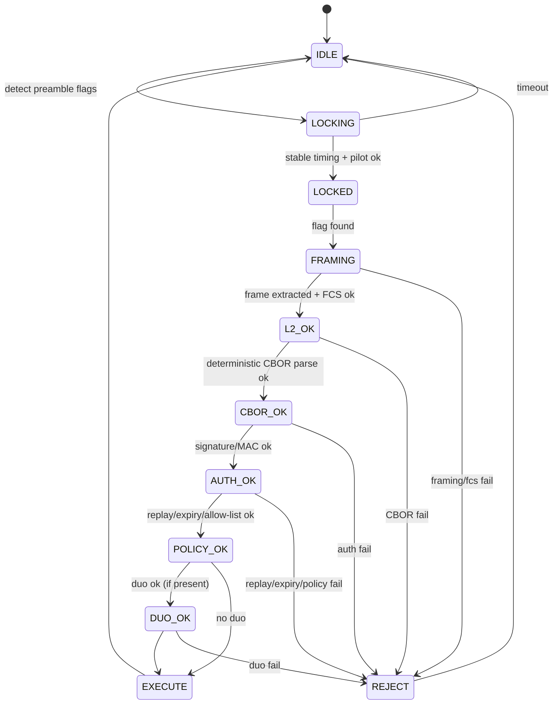

```markdown
---
title: "OWAC-MQP: One-Way Audio Control & Media Queue Protocol"
subtitle: "Unified Specification (Architecture + Duotronics Symbol Layer + v7 Final Implementable Freeze with Command Carousel Guidance)"
doc_id: "OWAC-MQP-UNIFIED"
spec_version: "0.3.4-draft"
protocol_version: 1
date: "2026-02-24"
status: "Draft (implementable, with frozen PHY/L2/CBOR/Auth profiles)"
---

# Preface

OWAC-MQP is a **unidirectional** control protocol intended to let an **air-gapped control workstation** send **authenticated, replay-resistant, fail-closed** control messages to an **internet-facing media server** over a simple **analog audio cable** (line-out → line-in). The design **does not** attempt confidentiality. Its primary security posture is:

- **Authenticity-first acceptance** (nothing state-changing executes unless cryptographic verification passes),
- **Deterministic parsing** (no ambiguity, no “best effort” interpretation),
- **Replay resistance without acknowledgements** (receiver-enforced),
- **Reject-by-default** under uncertainty,
- **High observability** (tamper/interference becomes visible via logs/metrics/alerts).

This unified document consolidates:
1) the architecture and threat-driven requirements,  
2) the **Duotronics** polygon-based symbol/representation layer (canonicalized and signed), and  
3) the **v0.2 implementable addendum** that freezes PHY/L2 constants, deterministic CBOR, authenticity profiles, replay rules, and a golden test-vector pipeline that starts at raw PCM audio.

**This version (0.3.4-draft) incorporates the normative changes described in Patches 0002–0011** plus the following correctness and interoperability fixes:
- Corrected expiry semantics (future timestamps are allowed, with an optional max lifetime).
- Resolved burst‑duration vs. message‑size contradiction by setting realistic per‑profile burst limits based on maximum message sizes.
- Clarified replay rules and crash‑consistency options.
- Added explicit duplicate‑key detection and parser requirements.
- Defined idempotence in terms of MID.
- Frozen RS and convolutional coding details to eliminate ambiguity.
- Tightened burst‑duration definitions, RS generator polynomial, unknown‑key rejection, transcript hash, and far‑future expiry code.
- Clarified unknown‑key handling for `cmd.args`, added receiver RS padding rule, adjusted burst duration rationale, fixed FCS self‑reference, added explicit indefinite‑length CBOR rejection, and clarified timer start.
- Fixed cross‑references and framing step wording.
- Specified initial encoder state for convolutional code.
- Added structural complexity limits.
- Clarified signature input (TranscriptBytes directly) and persistent state for duplicate handling.
- Defined `canon_hash` precisely.
- Added sender guidance for command carousel to improve reliability over unidirectional links.

---

# Table of Contents

- [1. Notation and Conventions](#1-notation-and-conventions)
- [2. System Model](#2-system-model)
- [3. Threat Model and Security Goals](#3-threat-model-and-security-goals)
- [4. Protocol Stack Overview](#4-protocol-stack-overview)
- [5. Physical Layer (Frozen Profile OWAC-PHY-AUD-A)](#5-physical-layer-frozen-profile-owacphy-aud-a)
- [6. Modem and Link Layer (Frozen)](#6-modem-and-link-layer-frozen)
- [7. Link Health and Observability (Normative)](#7-link-health-and-observability-normative)
- [8. Message Layer (Deterministic CBOR, Frozen)](#8-message-layer-deterministic-cbor-frozen)
- [9. Authenticity and Keying Profiles (PQ + Optional OTMAC)](#9-authenticity-and-keying-profiles-pq--optional-otmac)
- [10. Replay Resistance, Execute-Once, and Persistence](#10-replay-resistance-executeonce-and-persistence)
  - [10.1 Core Replay Rule](#101-core-replay-rule-normative-frozen)
  - [10.2 Duplicate Handling](#102-duplicate-handling-normative-frozen)
  - [10.3 Crash Consistency and Execute‑Once Guarantee](#103-crash-consistency-and-executeonce-guarantee-two-models)
  - [10.4 Idempotence Requirements](#104-idempotence-requirements)
  - [10.5 Quorum Mode](#105-quorum-mode-optional-highassurance-reliability-gate)
  - [10.6 Rollback Resistance](#106-rollback-resistance-normative)
  - [10.7 Sender Redundancy and Command Carousel](#107-sender-redundancy-and-command-carousel-informative-guidance)
- [11. Application Layer: Allow-Listed Command Set](#11-application-layer-allowlisted-command-set)
- [12. Duotronics Symbol Layer (Normative)](#12-duotronics-symbol-layer-normative)
- [13. Song-Driven Control (Optional Extension)](#13-songdriven-control-optional-extension)
- [14. Bulk Transfer over Audio (Optional, Quarantined)](#14-bulk-transfer-over-audio-optional-quarantined)
- [15. Conformance, Golden Vectors, and Test Strategy](#15-conformance-golden-vectors-and-test-strategy)
- [16. Environmental / EMI Qualification Guidance](#16-environmental--emi-qualification-guidance)
- [17. Registries and Extension Points](#17-registries-and-extension-points)
- [Appendix A: Receiver Pipeline State Machine](#appendix-a-receiver-pipeline-state-machine)
- [Appendix B: Deterministic CBOR CDDL (Normative)](#appendix-b-deterministic-cbor-cddl-normative)
- [Appendix C: CRC/FCS Reference Algorithm (PPP FCS-16)](#appendix-c-crcfcs-reference-algorithm-ppp-fcs16)
- [Appendix D: Duotronics Canonicalization Reference Pseudocode](#appendix-d-duotronics-canonicalization-reference-pseudocode)
- [Appendix E: Reject Reasons (Normative Codes)](#appendix-e-reject-reasons-normative-codes)
- [Appendix F: Worked End-to-End Example](#appendix-f-worked-endtoend-example)
- [References](#references)

---

# 1. Notation and Conventions

## 1.1 RFC 2119 Terms

The key words **MUST**, **MUST NOT**, **REQUIRED**, **SHALL**, **SHALL NOT**, **SHOULD**, **SHOULD NOT**, **RECOMMENDED**, **MAY**, and **OPTIONAL** are to be interpreted as described in RFC 2119.

## 1.2 Normative vs Informative

- **Normative** sections define required behavior and interoperability constraints.
- **Informative** sections provide rationale, guidance, and optional patterns.

## 1.3 “Fail-Closed” Rule (Global)

If any validation gate fails at any layer, the receiver **MUST**:
1) reject the message (no state change), and  
2) emit observable evidence (structured log event and metric increment), and  
3) include a **specific reject reason code** (Appendix E).

---

# 2. System Model

## 2.1 Nodes

- **ACN (Air-Gapped Control Node):** operator workstation; no internet access; transmits only via analog line-out.
- **IMN (Internet-Facing Media Node):** server; receives audio via line-in; performs decode → verify → allow-list execute.

## 2.2 Trust Boundaries

- The audio cable is treated as a **unidirectional “diode-like” path**.
- There is **no** protocol acknowledgement or return channel.

## 2.3 Design Assumptions

- Physical access may be contested (EMI/injection possible).
- Availability under jamming is **not required**, but **tamper/interference must be observable**.

---

# 3. Threat Model and Security Goals

## 3.1 Threats Considered

The receiver must assume:
- EMI/RF coupling into cable or audio front-end (distortion, clipping, tone injection).
- Direct audio injection (electrical coupling, near-field, conducted).
- Replay of previously captured valid transmissions.
- Jamming (denial of service).
- Parser ambiguity exploitation (inconsistent canonicalization / encoding).

## 3.2 Non-Goals

- Confidentiality of commands.
- Robust operation under continuous active jamming.
- Remote administration of IMN over the same audio channel.

## 3.3 Security Goals

- **G1: Deterministic Parse:** one on-wire payload → exactly one transcript or reject.
- **G2: Authenticated Execution:** state changes only after authenticity verification.
- **G3: Replay Resistance:** receiver-enforced monotonic acceptance.
- **G4: Fail-Closed Under Uncertainty:** reject ambiguous/invalid input.
- **G5: Observability:** interference/tamper becomes visible.

---

# 4. Protocol Stack Overview

OWAC-MQP is layered:

1) **PHY**: analog audio profile (sampling, levels, pilot)  
2) **Modem**: AFSK demod + NRZI bit recovery  
3) **L2**: HDLC-like framing + bit stuffing + CRC/FCS  
4) **L3 Message**: deterministic CBOR envelope + size limits  
5) **Auth**: PQ signature (default) or optional one-time MAC family  
6) **Replay/Policy gates**: strict counters, expiry, allow-lists  
7) **Application**: media queue / transport / bounded “text intent” only  
8) **Duotronics (symbol layer)**: canonical representation inside the signed transcript

Mermaid overview:

```mermaid
flowchart TD
  A[PCM audio in] --> B[AFSK demod + NRZI]
  B --> C[HDLC-like framing\n+ unstuffing + FCS]
  C --> D[CBOR decode\n(deterministic rules)]
  D --> E[TranscriptBytes recompute\n(message with auth present but with auth.sig omitted)]
  E --> F[Verify signature/MAC]
  F --> G[Replay + expiry + policy gates]
  G --> H[Duotronics canonicalization (if present)]
  H --> I[Allow-listed command execution]
  C -->|FCS fail| X[Reject + log/metrics]
  F -->|auth fail| X
  G -->|replay/expiry/policy fail| X
  H -->|duo fail| X
```

---

# 5. Physical Layer (Frozen Profile OWAC-PHY-AUD-A)

## 5.1 Audio Capture/Playback Format (Normative)

* Sample rate: **48,000 Hz**
* Channels: **mono**
* Sample format: **16-bit signed PCM**
* Golden test vectors **MUST** use exactly this format.

## 5.2 Physical Interconnect (Normative Options)

### 5.2.1 High-Assurance Interconnect (RECOMMENDED)

* Balanced line level (e.g., XLR or equivalent) with **galvanic isolation transformer** at least at IMN input.

### 5.2.2 Development / Low-Assurance

* Unbalanced line-out/line-in MAY be used, but all monitoring and reject rules still apply.

## 5.3 Amplitude and Clipping Policy (Normative)

IMN **MUST** compute:

* clipped sample count per second,
* RMS level per 100 ms window,
* near-silence detection (configurable threshold).

If clipping exceeds a configured threshold in any window that overlaps a candidate frame, IMN **MUST** set `link_suspect=true` and include it in the audit event.

## 5.4 Pilot Tone (OWAC-PILOT-19K) (Normative for Profile OWAC-PHY-AUD-A)

* A 19.000 kHz sine pilot **SHALL** be mixed into the transmitted signal at **−30 dBFS RMS** relative to the payload RMS.
* IMN **SHALL** continuously track pilot amplitude and phase stability.
* Abrupt pilot loss, saturation, or large excursions **MUST** produce:

  * metric increment (`owac_link_pilot_fault_total`),
  * structured log event,
  * `link_suspect=true` annotation on any overlapping command decisions.

> Note: If specific deployed audio hardware rolls off 19 kHz, define a hardware-specific profile ID rather than weakening acceptance logic.

## 5.5 AFSK Generation (Normative)

To ensure interoperability across different audio hardware, the following AFSK generation parameters are frozen:

* **Modulation:** Frequency-shift keying with continuous phase (no phase discontinuities at symbol boundaries).  
* **Symbol shaping:** None; raw sine segments of the exact mark/space frequencies are used.  
* **Amplitude:** The payload RMS level (excluding pilot) **SHOULD** be between −12 dBFS and −6 dBFS at the transmitter output to provide headroom and avoid clipping.  
* **Crest factor:** The transmitter **MUST** ensure that the combined signal (payload + pilot) does not clip the DAC; a crest factor of at least 3 dB headroom is RECOMMENDED.

## 5.6 Receiver Input Level and Processing (Normative)

The IMN **MUST** be configured to disable any automatic gain control (AGC), noise suppression, or audio enhancement features on the input path. The nominal RMS level at the IMN ADC **SHOULD** be between −18 dBFS and −6 dBFS for reliable demodulation. If the input is stereo, the receiver **MUST** use only the left channel (or a configuration‑selected channel) and ignore the other.

---

# 6. Modem and Link Layer (Frozen)

## 6.1 Modulation: OWAC-AFSK-1200 (Normative)

* Baud rate: **1200**
* Mark (logic 1): **1200 Hz**
* Space (logic 0): **2200 Hz**
* Initial tone state at start of burst: **Mark**

## 6.2 Line Coding: NRZI (Normative)

NRZI mapping:

* Data bit **0** ⇒ **transition** (toggle between mark/space)
* Data bit **1** ⇒ **no transition**

## 6.3 Bit and Byte Ordering (Normative)

* Bits are assembled into octets **LSB-first** on the physical bitstream.
* The HDLC flag 0x7E corresponds to bit sequence `01111110` (LSB-first transmission implies wire order conventions must be frozen; implementers MUST follow the conformance vectors for exact behavior).

## 6.4 Framing: HDLC-Like Envelope (Normative)

### 6.4.1 Flag and Preamble

* Frame delimiter (flag): **0x7E**
* Preamble: transmitter **SHALL** send **≥ 32** consecutive flags before each burst.
* Flags are part of the continuous NRZI stream; they are **not** subject to bit stuffing.

### 6.4.2 Bit Stuffing (Transparency)

* Between opening and closing flags, transmitter inserts a **0 bit** after any run of **five (5) consecutive 1 bits**.
* Receiver removes any **0 bit** that immediately follows five consecutive 1 bits.
* Stuffing applies across **payload + FCS bits** (everything between flags).

### 6.4.3 Frame Extraction Rules

Receiver **MUST** reject (no partial interpretation):

* frames not bounded by flags,
* frames that do not decode into whole octets after unstuffing,
* empty frames (back-to-back flags) are ignored (not counted as errors).

## 6.5 FCS/CRC: PPP FCS-16 (Normative)

Freeze the exact parameters:

* Polynomial (normal form): **x^16 + x^12 + x^5 + 1**
* Reflected representation: **0x8408**
* Initial value: **0xFFFF**
* Final check (“good” value after including received FCS): **0xF0B8**
* Transmit FCS bytes: **LSB first** (low byte, then high byte)
* Computation: compute over frame bytes (excluding flags), ones-complement, append.

(Reference algorithm in Appendix C.)

## 6.6 FEC Profiles and Ordering (Normative if used, Frozen)

FEC is **availability-oriented**. It **MUST NOT** replace cryptographic authentication.

FEC behavior is determined solely by `profile` (no negotiation).

### 6.6.1 Common Baseline (No FEC) — Profile 1

For `profile=1 (OWAC-PHY-AUD-A)`:

TX order (between bursts):

1. Construct `MsgBytes` (deterministic CBOR)
2. Form L2 frame body: `FrameBody = MsgBytes || FCS16(MsgBytes)`
3. Convert `FrameBody` to bits LSB-first
4. Apply HDLC bit stuffing across **FrameBody bits**
5. Apply NRZI line coding
6. AFSK modulate
7. Add flags: preamble flags + opening flag + stuffed NRZI-coded body + closing flag
   (flags are not part of the stuffed body)

RX is the exact inverse: detect flags → NRZI decode → unstuff → octetize → verify FCS → extract CBOR.

### 6.6.2 Reed–Solomon + Interleave — Profile 2

For `profile=2 (OWAC-PHY-AUD-A-FEC-RS16I2)`:

Reed–Solomon is **octet-domain** and is applied **before** bit stuffing.

TX order:

1. Construct `MsgBytes`
2. Form L2 base bytes: `BaseBytes = MsgBytes || FCS16(MsgBytes)`
3. Apply RS(255,223) with interleaving depth I=2 over `BaseBytes` to produce `FecBytes`
   (exact chunking and padding rules below)
4. Convert `FecBytes` to bits LSB-first
5. Apply HDLC bit stuffing across **FecBytes bits**
6. Apply NRZI
7. AFSK modulate and add flags as in 6.6.1

RX order:

1. Detect flags and extract body
2. NRZI decode
3. HDLC unstuff
4. Octetize to recover `FecBytes`
5. RS de-interleave and decode to recover `BaseBytes` (or reject)
6. Verify FCS on recovered `BaseBytes`
7. Extract `MsgBytes`

**RS Chunking / Padding (Frozen):**

* `BaseBytes` is segmented into blocks of **223 bytes**.
* The final block is padded with **0x00** bytes to 223 bytes.
* Each 223-byte block is encoded into a 255-byte RS codeword.
* Interleaving depth I=2 is applied **to consecutive pairs of codewords**. Specifically, after encoding all blocks into codewords `C[0], C[1], C[2], …`, the transmission order is:
  - For i = 0,1,2,… (each pair):
    - If an odd number of codewords remains, pad with an all‑zero codeword (255 bytes of 0x00) to form a pair.
    - Transmit `C[2i][0], C[2i+1][0], C[2i][1], C[2i+1][1], …, C[2i][254], C[2i+1][254]`.
* After RS decode, the receiver obtains `BaseBytes` (which may include padding bytes added to the final block). **Receiver deinterleaving MUST assume that the final pair may include an all‑zero padded codeword; after RS decode, the padded codeword's contribution is ignored by the following extraction rule.** The receiver then extracts the actual message as follows: parse exactly one CBOR item from the beginning of `BaseBytes`; that item yields `MsgBytes` of length `L`. The next two bytes after the CBOR item **MUST** be the FCS-16 computed over `MsgBytes`. Any remaining bytes after the FCS are padding and **MUST** be ignored. If the CBOR item cannot be parsed, or the FCS does not verify, reject with `REJ_CBOR_PARSE` or `REJ_L2_FCS_FAIL` as appropriate.

**RS Coding Constants (Normative):**

* Galois field: GF(2^8) with primitive polynomial **0x11D** (x^8 + x^4 + x^3 + x^2 + 1).
* Encoding is **systematic** (the first 223 bytes of each codeword are the original data).
* Let α be the element represented by the byte 0x02 under the given field. The generator polynomial is \( g(x) = \prod_{i=0}^{31} (x - \alpha^i) \) (i.e., roots α⁰, α¹, …, α³¹).
* A codeword consists of 223 data bytes followed by 32 parity bytes, where the parity bytes are ordered from the coefficient of x⁰ to x³¹ in the remainder polynomial.

### 6.6.3 Convolutional Code (Rate 1/2) — Profile 3

For `profile=3 (OWAC-PHY-AUD-A-FEC-CC-1_2)`:

Convolutional coding is **bit-domain** and its ordering is frozen as:

TX order (between bursts):

1. Construct `MsgBytes`
2. Form L2 frame body: `FrameBody = MsgBytes || FCS16(MsgBytes)`
3. Convert `FrameBody` to bits LSB-first
4. Apply HDLC bit stuffing across those bits
5. Append **K‑1 = 6 zero bits** to the stuffed bit stream (tail bits) to force the encoder to the all‑zeros state.
6. Apply convolutional encode (rate 1/2, constraint length K=7, generators 171(octal),133(octal)) to the entire bit stream (including the tail bits) to produce encoded bits.
7. Apply NRZI line coding
8. AFSK modulate and add flags as in 6.6.1

RX order:

1. Detect flags, extract body bits
2. NRZI decode
3. Viterbi decode (rate 1/2) to recover the original stuffed bit stream (including tail bits)
4. **Discard the last 6 bits** (the tail bits) from the Viterbi output.
5. HDLC unstuff the remaining bits
6. Octetize to recover `FrameBody`
7. Verify FCS
8. Extract `MsgBytes`

**Convolutional Coding Constants (Normative):**

* Constraint length K = 7, generators G1 = 171 (octal), G2 = 133 (octal).
* Encoding is **non-punctured**; each input bit produces two output bits (G1 first, G2 second).
* Trellis termination: as above, six zero bits are appended **after** stuffing and **before** encoding.
* **Encoder initial state:** The encoder's shift register is initialized to all zeros at the start of each frame (i.e., before the first data bit). The decoder MUST assume the same initial state (zero).
* Viterbi decoding at the receiver **MUST** use **hard‑decision** inputs (from the demodulated bit stream) and a traceback depth of at least **5 × K** (35 bits) to ensure reliable decisions. In case of ties in the Viterbi path metric, the decoder **MUST** choose the path with the lower state number, where the state number is the integer value of the shift‑register contents with the most recent input bit as the least significant bit (LSB). This ensures deterministic tie‑breaking.

> Any FEC profile not listed here **MUST** be assigned a distinct profile ID and its ordering frozen analogously.

## 6.7 Profile Selection and Decoding (Normative)

Because the `profile` field is inside the CBOR message, the receiver must know which profile to use for demodulation and FEC decoding before it can extract the CBOR. To resolve this paradox, the following rule applies:

* The IMN **MUST** be configured with exactly one active profile ID (e.g., `1` for baseline, `2` for RS, or `3` for convolutional). This configuration is out‑of‑band and static per deployment.
* The receiver **MUST** attempt to decode the incoming audio burst using **only** the configured profile. It **MUST NOT** attempt multiple profiles or switch profiles dynamically.
* After successfully decoding the L2 frame, extracting the CBOR, and verifying the FCS, the receiver **MUST** check that the `profile` field in the CBOR message (key 1) equals the configured profile ID. If they do not match, the message is rejected with `REJ_PROFILE_MISMATCH` (see Appendix E).

This ensures that the profile is both used for decoding and cryptographically bound inside the signed message.

> Changing the configured profile is a security‑sensitive event and SHOULD be logged and typically require an epoch bump or re‑provisioning.

## 6.8 Burst Duration and Timeout Limits (Normative)

To prevent denial‑of‑service and decoder resource exhaustion, the receiver **MUST** enforce the following per‑profile burst duration limits. These limits are **normative caps** chosen to accommodate the largest allowed `MsgBytes` (Section 8.5) across supported authentication algorithms, including a conservative estimate of HDLC bit‑stuffing overhead and preamble flags. The rationale is informative; the actual caps are binding.

| Profile ID | Maximum burst duration (seconds) | Informative rationale (based on MAX_MSG_BYTES=12288 for alg=2) |
|------------|----------------------------------|---------------------------------------------------------------|
| 1          | 110                              | 12288 bytes × 8 × stuffing factor (~1.2) / 1200 ≈ 98 s, plus ~12 s conservative margin |
| 2          | 130                              | RS overhead (~1.14) adds ~14% to raw bits, plus same margin  |
| 3          | 210                              | Convolutional rate 1/2 doubles bits; 12288×8×2×1.2/1200 ≈ 197 s, plus margin |

The receiver **MUST** start a timer upon detecting the opening flag; if the closing flag is not received within the maximum burst duration, the receiver **MUST** abort the frame and reject with `REJ_BURST_TOO_LONG`. The timer does not count the preamble flags; the caps include a conservative margin to account for preamble and other overhead.

Additionally, the receiver **MUST** enforce timeouts for each pipeline stage (locking, framing, CBOR parse, auth verify) to prevent resource exhaustion. These timeouts are implementation‑specific but **SHOULD** be documented in deployment guides. Timeouts MUST NOT depend on message content except for size‑based upper bounds, and MUST be fixed per deployment profile.

When `link_suspect=true` (due to pilot faults or clipping), the receiver **MAY** apply stricter gating, e.g., only accept `HEARTBEAT` commands unless quorum mode (Section 10.5) is satisfied.

---

# 7. Link Health and Observability (Normative)

IMN **MUST** expose:

## 7.1 Metrics (Minimum Set)

* `owac_link_lock_events_total{state=lock|unlock}`
* `owac_l2_frames_total{result=ok|fcs_fail|framing_fail}`
* `owac_auth_total{result=ok|fail|sig_len|kid_unknown}`
* `owac_replay_total{result=replay|duplicate|expired}`
* `owac_policy_total{result=allow|deny|unknown_cmd|bad_args}`
* `owac_link_pilot_fault_total`
* `owac_link_clipping_windows_total`
* `owac_burst_too_long_total` (increment when a burst exceeds the duration limit)

## 7.2 Structured Logs (Minimum Fields)

Every candidate frame decision **MUST** log:

* timestamp
* profile_id
* link health snapshot (`pilot_ok`, `clipping`, `rms`, `lock_state`)
* decision (`accept|reject|ignore`)
* reject reason code (Appendix E) if reject
* if accept: `(epoch,sid,ctr)`, command type, and a transcript hash (SHA-256 of TranscriptBytes, see §8.9)

## 7.3 Alerts (Policy Guidance)

Operator alerting SHOULD be derived from:

* sustained pilot faults,
* spikes in FCS failures,
* spikes in auth failures,
* repeated replays/expired counters,
* sustained lock/unlock oscillation,
* spikes in `owac_burst_too_long_total`.

---

# 8. Message Layer (Deterministic CBOR, Frozen)

## 8.1 Deterministic CBOR Rules (Normative)

Messages are CBOR with **deterministic encoding**:

* Indefinite-length items **MUST NOT** appear. If any indefinite-length item is encountered during decode, the receiver MUST reject with `REJ_CBOR_INDEFINITE` (not `REJ_CBOR_NOT_DET`).
* Map keys **MUST** be sorted by bytewise lexicographic order of their deterministic encodings.
* Floating point **SHOULD NOT** be used in signed content. If unavoidable, a quantization policy ID MUST be included and enforced.
* Integer encodings **MUST** be in the smallest possible representation (e.g., 0–23 use one‑byte format, 24–255 use one‑byte `uint` with additional byte, etc.). Non‑minimal encodings are invalid.
* Duplicate map keys are invalid and **MUST** cause rejection with `REJ_CBOR_PARSE`. Implementations **MUST** use a CBOR parser that detects duplicate keys during decoding (or perform an additional structural scan) and rejects the message if any duplicate is found. Decoders that silently drop earlier keys or keep the last occurrence are not compliant.

**General unknown‑key rule:** Unless explicitly stated otherwise (e.g., for the `ext` container), any unknown key appearing in a protocol‑defined map (`mid`, `cmd`, `auth`, `meta`) **MUST** cause rejection with `REJ_CBOR_PARSE`. This ensures forward compatibility is managed only through the designated extension points. This rule does not apply to `cmd.args`, which is validated per command type (Section 11) and rejects unknown args with `REJ_BAD_ARGS`.

## 8.2 Top-Level Message Envelope (Normative)

Top-level CBOR map with small unsigned integer keys:

| Key | Name      | Type | Required | Meaning                                        |
| --- | --------- | ---- | -------- | ---------------------------------------------- |
| 0   | `v`       | uint | yes      | Protocol version; MUST be 1                    |
| 1   | `profile` | uint | yes      | PHY/L2 profile ID                              |
| 2   | `mid`     | map  | yes      | Message identity + replay controls             |
| 3   | `cmd`     | map  | yes      | Typed command                                  |
| 4   | `auth`    | map  | yes      | Authenticity container                         |
| 5   | `meta`    | map  | no       | Optional metadata (not required for execution) |
| 6   | `ext`     | map  | no       | Extension container (see Section 8.8)          |

Unknown keys at the top level (other than 0–6) ⇒ **REJECT** with `REJ_CBOR_PARSE`.

## 8.3 `mid` Structure (Normative)

`mid` is a CBOR map:

* `0`: `epoch` (uint64)
* `1`: `ctr` (uint64)
* `2`: `sid` (bstr, **16 bytes**)
* `3`: `exp` (uint, Unix seconds) OPTIONAL but RECOMMENDED

**Time and Clock Semantics for `exp`:**

* The receiver compares `exp` against its current system time (Unix seconds) with a **configurable skew allowance** `±Δ` (default Δ = 30 seconds) to accommodate minor clock drift.
* **Acceptance condition:** The message is accepted with respect to expiry **iff** `now ≤ exp + Δ`. (A message with `exp` in the future is **not** rejected solely because it is future‑dated; it will be accepted until it expires.)
* **Optional far‑future guard:** Implementations MAY also enforce an upper bound `MAX_LIFETIME` (e.g., 24 hours) to reject commands that are dated too far in the future. If this guard is enabled and `exp > now + MAX_LIFETIME`, the receiver **MUST** reject with `REJ_EXP_TOO_FAR`. This guard is RECOMMENDED to prevent replay attacks using very distant expiry timestamps.
* If the receiver’s clock jumps backward or forward by more than a deployment‑specific threshold (e.g., 5 seconds) within a short interval, it **MUST** log a security event and **MAY** temporarily require quorum or deny non‑heartbeat commands until clock stability is confirmed.

Unknown keys inside `mid` ⇒ reject `REJ_CBOR_PARSE`.

## 8.4 `cmd` Structure (Normative)

`cmd` is a CBOR map:

* `0`: `type` (uint) command enum
* `1`: `args` (map) type-specific
* `2`: `duo` (bstr) OPTIONAL Duotronics payload or catalog reference

Unknown `cmd.type` ⇒ **REJECT** with `REJ_UNKNOWN_CMD`.  
Unknown keys inside `cmd` (other than 0–2) ⇒ **REJECT** with `REJ_CBOR_PARSE`.

## 8.5 Size Limits (Normative, Frozen)

All size limits below apply to the **CBOR message bytes as carried in L2 payload** (i.e., before HDLC framing overhead).

### 8.5.1 Algorithm-Specific Whole-Message Limits

Let `MsgBytes = DeterministicCBOR(OWAC_Message)` (the fully encoded message including `auth`).

IMN **MUST** enforce `len(MsgBytes) ≤ MAX_MSG_BYTES(auth.alg)` where:

| `auth.alg` | Name                  | `MAX_MSG_BYTES` |
|----------:|------------------------|----------------:|
| 1         | `ML-DSA-65`            | 4096            |
| 2         | `SLH-DSA-SHA2-128s`    | 12288           |
| 3         | `OTMAC-WC-v1`          | 4096            |

Exceeding the applicable limit ⇒ **REJECT** with `REJ_SIZE_LIMIT`.

> Rationale: `SLH-DSA-SHA2-128s` signatures are large; this limit is frozen to support “critical ops” without requiring fragmentation.

### 8.5.2 Sub-structure Limits (Unchanged, Still Required)

Additionally, IMN **MUST** enforce:

* `cmd.args` deterministic encoding: **≤ 1024 bytes**
* any `tstr`: **≤ 256 bytes**
* any `bstr` **except signature**: **≤ 2048 bytes**
* any `meta` map (if present): **≤ 512 bytes** (deterministically encoded)

Exceeding any limit ⇒ **REJECT** with `REJ_SIZE_LIMIT`.

### 8.5.3 Structural Complexity Limits (Normative)

To prevent resource exhaustion during CBOR parsing, the receiver **MUST** enforce the following limits during decoding:

* Maximum nesting depth of arrays/maps: **32**
* Maximum number of entries in a single map: **64**
* Maximum number of items in a single array: **256**
* Maximum total number of items (count of all arrays, maps, and simple values) in the entire message: **1024**

If any of these limits is exceeded, the receiver **MUST** reject with `REJ_CBOR_PARSE`.

## 8.6 Canonical Transcript Bytes (Normative, Frozen)

Let `OWAC_Message` be the received CBOR data model.

Define `AUTH_TBS` (“auth to-be-signed”) as the `auth` map with the signature/MAC bytes excluded:

`AUTH_TBS = { 0: alg, 1: kid, ?3: ctx }`  (i.e., `auth[2]` omitted)

Define `Message_TBS` as the message where key `4` (`auth`) is replaced by `AUTH_TBS`.

Then:

`TranscriptBytes = DeterministicCBOR(Message_TBS)`

Authenticity verification **MUST** be over `TranscriptBytes` (the full byte string). No pre‑hashing is applied; the signature algorithms defined in Section 9 operate directly on `TranscriptBytes`.

## 8.7 Deterministic CBOR Validation Algorithm (Normative)

To ensure that the received CBOR strictly follows deterministic encoding rules, the receiver **MUST** perform the following check:

1. Decode the received `MsgBytes` into a CBOR data model, **detecting duplicate keys** and **indefinite-length items** during parsing (see §8.1). If duplicates are found, reject immediately with `REJ_CBOR_PARSE`. If any indefinite-length item is encountered, reject with `REJ_CBOR_INDEFINITE`.
2. Re‑encode that data model using the deterministic encoding rules defined in Section 8.1.
3. Compare the re‑encoded byte string to the original `MsgBytes` byte‑for‑byte.
4. If they do not match exactly, reject with `REJ_CBOR_NOT_DET`.

This check **MUST** be applied before any further processing (e.g., before transcript recomputation). It also applies recursively to any CBOR‑in‑bstr inside `cmd.duo` when Mode A (direct canonical payload) is used; if a mismatch occurs inside `duo`, the rejection code is `REJ_DUO_CANON_FAIL`.

## 8.8 Extension Container (Optional Forward Compatibility)

The top‑level key `6` (if present) contains an `ext` map. This map is reserved for future extensions. Unknown keys inside `ext` are **ignored** (i.e., they do not cause rejection), but the entire `ext` map is included in `TranscriptBytes` (Section 8.6) and therefore signed. This allows forward‑compatible additions without breaking strict “unknown key” rejection.

If a receiver does not understand any extension keys, it **MUST** still process the rest of the message normally, provided all other gates pass. The presence of an unrecognized extension key **MUST NOT** cause rejection, but it **SHOULD** be logged for observability.

## 8.9 Transcript Hash Definition (Normative)

For replay handling (Section 10.2) and logging, the term `transcript_hash` means the SHA-256 hash of `TranscriptBytes` (as defined in §8.6). The hash is computed over the exact byte string produced by deterministic CBOR encoding of the `Message_TBS` structure.

---

# 9. Authenticity and Keying Profiles (PQ + Optional OTMAC)

## 9.1 Auth Container (Normative)

`auth` is a CBOR map:

* `0`: `alg` (uint) algorithm enum
* `1`: `kid` (bstr, **16 bytes**) key identifier (receiver-pinned)
* `2`: `sig` (bstr) signature/MAC bytes
* `?3`: `ctx` (bstr, max 32 bytes) domain separation context (default empty)

Rules:

* Unknown `kid` ⇒ **REJECT** with `REJ_KID_UNKNOWN`.
* Signature length mismatch for the `alg` ⇒ **REJECT** with `REJ_SIG_LEN`.
* `ctx` (if present) **MUST** be included in `TranscriptBytes` via Section 8.6, and thus is cryptographically bound.
* Unknown keys inside `auth` (other than 0–3) ⇒ **REJECT** with `REJ_CBOR_PARSE`.

## 9.2 Context Echo and Symmetry (Normative)

If `meta[0]` is present (see Appendix B), it is an **echo** of `auth[3]=ctx`. The receiver **MUST** enforce:

* If `meta[0]` is present and `auth[3]` is present, they **MUST** be bytewise equal; otherwise reject with `REJ_CTX_MISMATCH`.
* If `auth[3]` is present and `meta[0]` is absent, the message is **still valid** (the echo is optional).
* If `meta[0]` is present and `auth[3]` is absent, reject with `REJ_CTX_MISMATCH`.

This rule ensures that any context supplied in the authenticated portion can be echoed in the metadata for observability, without creating ambiguity.

## 9.3 PQ Signature Profiles (Normative Defaults)

OWAC defines two mandatory-to-implement verification modes at IMN. In all cases, the signature is computed over `TranscriptBytes` (the full byte string as defined in §8.6); no pre‑hashing is applied.

* **ML-DSA-65** (default command signing)
  * Signature length: **3309 bytes**
  * Public key length: **1952 bytes**
* **SLH-DSA-SHA2-128s** (critical operations / epoch changes)
  * Signature length: **7856 bytes**

> Deployment may disable one, but the spec’s conformance suite assumes IMN can verify ML-DSA-65 at minimum.

## 9.4 Optional OTMAC (Information-Theoretic) Family (Optional)

An optional profile MAY support one-time universal-hash authentication (Wegman-Carter-style). If used, the MAC is computed over `TranscriptBytes` (or a keyed hash thereof) as defined by the specific OTMAC profile. One-time key reuse MUST be treated as catastrophic and MUST hard-fail (reject + alert). OTMAC is best used as a fast inner mechanism with PQ-signed epochs provisioning one-time key batches.

---

# 10. Replay Resistance, Execute-Once, and Persistence

## 10.1 Core Replay Rule (Normative, Frozen)

Per `(sid,kid)` pair, IMN maintains `(last_epoch, last_ctr, last_transcript_hash)` in durable, rollback-resistant storage.

Define `E := mid.epoch` and `C := mid.ctr`.

Acceptance requires:

1) **Monotonicity:** `(E, C) > (last_epoch, last_ctr)` under lexicographic ordering, i.e.  
   * either `E > last_epoch`, OR  
   * `E == last_epoch` AND `C > last_ctr`

2) **Expiry (if present):** if `mid.exp` present then `now ≤ exp + Δ` (with Δ the configured skew, default 30 seconds). (See §8.3 for the complete expiry semantics, including the optional far‑future guard which, if violated, yields `REJ_EXP_TOO_FAR`.)

If accepted and released to execution, the receiver **MUST** atomically persist `(last_epoch, last_ctr, last_transcript_hash) := (E, C, transcript_hash)` according to one of the persistence models described in §10.3. The tuple MUST be stored together durably and atomically.

## 10.2 Duplicate Handling (Normative, Frozen)

Define `MID := (epoch, sid, ctr)`.

Per `(sid,kid)`, IMN retains the most recently accepted `transcript_hash` (SHA-256 of TranscriptBytes, as defined in §8.9) for `(last_epoch,last_ctr)` as part of the persisted state.

* If a message arrives with `epoch == last_epoch` AND `ctr == last_ctr` AND its `transcript_hash` equals the retained hash for that `(sid,kid)`, treat as **DUPLICATE**:
  * do not re-execute
  * log `duplicate=true`
  * increment `owac_replay_total{result=duplicate}`

* Any message for which `(epoch,ctr) < (last_epoch,last_ctr)` is **REPLAY** ⇒ reject `REJ_REPLAY`.

* Any message for which `(epoch,ctr) == (last_epoch,last_ctr)` but `transcript_hash` differs is **REPLAY** ⇒ reject `REJ_REPLAY` (this prevents ambiguous same‑counter replays).

## 10.3 Crash Consistency and Execute‑Once Guarantee (Two Models)

Because the receiver must persist state before execution to prevent replay after a crash, two implementation models are allowed:

### Model A: Persist Before Execute (Simple, At‑Most‑Once)

* Persist `(last_epoch,last_ctr,last_transcript_hash)` atomically **before** releasing the command to the actuator.
* If a crash occurs after persistence but before execution, the command is permanently lost (the sender must retransmit with a higher counter). This gives an “at‑most‑once” guarantee.

### Model B: Two‑Phase Durable Journal (Exactly‑Once Semantics)

To provide stronger guarantees (no loss after persistence), implementations MAY adopt a **two‑phase journal**:

* **Phase 1 – Pending:** Before execution, atomically write a `PENDING` record containing `(mid, transcript_hash)` to durable storage.
* **Phase 2 – Execute:** Perform the command action (which **MUST** be idempotent, see Section 10.4).
* **Phase 3 – Committed:** After successful execution, atomically replace the `PENDING` record with an `EXECUTED` record (or delete it) and update `(last_epoch,last_ctr,last_transcript_hash)`.

On recovery after a crash, the IMN **MUST** check for any `PENDING` record without a corresponding `EXECUTED` record. If found, it **MUST** re‑execute the command exactly once (relying on idempotence) and then mark it as executed. This ensures that no command is permanently lost due to a crash between persistence and actuation.

Both models are compliant; the choice depends on deployment requirements. The protocol’s base guarantee is “at‑most‑once”, with Model B providing “exactly‑once” semantics when idempotence holds.

## 10.4 Idempotence Requirements

All command types defined in Section 11 **MUST** be idempotent with respect to `MID`. This means: for a given `(sid, kid, epoch, ctr)`, executing the command multiple times (due to retransmission or recovery) MUST have the same effect as executing it once. Implementations MUST ensure that any side effects (e.g., enqueuing a track) are keyed by `MID` so that duplicate execution does not create duplicate actions. For example, a `QUEUE_TRACK` command can store the `MID` of already‑enqueued items and skip enqueue if the same `MID` is seen again (even after recovery).

## 10.5 Quorum Mode (Optional, High‑Assurance Reliability Gate)

IMN MAY be configured for **QUORUM** acceptance per MID:

* Require at least **K** independently decoded instances of the *same* `TranscriptBytes` within window **W** before execution.
* In QUORUM mode, IMN MUST NOT advance the persisted `(last_epoch,last_ctr)` until quorum is reached.

Recommended starting point: K=2, W=3 seconds, with ACN sending N=3 repeats spaced randomly over 1–2 seconds.

## 10.6 Rollback Resistance (Normative)

To prevent replay via state rollback:

* `(last_epoch,last_ctr,last_transcript_hash)` storage MUST be rollback-resistant (write-ahead log + fsync at minimum; hardware monotonic counter if available).
* Any administrative reset that would allow re-use of counters **MUST** increment `mid.epoch` for subsequent commands and MUST be logged as a security event. IMN **MUST NOT** accept a command whose `(epoch,ctr)` is ≤ the persisted `(last_epoch,last_ctr)` for that `(sid,kid)`.

## 10.7 Sender Redundancy and Command Carousel (Informative Guidance)

Because OWAC-MQP is unidirectional and provides no acknowledgements, the sender (ACN) must anticipate that individual audio bursts may be corrupted or lost due to transient noise, clipping, or interference. The protocol’s strict fail‑closed behavior means that any corrupted bit results in silent rejection (no state change). To improve the probability that a command reaches the IMN, senders SHOULD employ a **command carousel** strategy.

### 10.7.1 Why Simple Repetition Fails

Simply playing the same audio burst multiple times will not work: the IMN’s replay protection (Section 10.2) will treat identical messages (same `epoch`, `ctr`, and `transcript_hash`) as **DUPLICATE** after the first successful reception, and will not re‑execute them. While duplicates are logged and counted, they do not contribute to state change.

### 10.7.2 Sliding Window Carousel

A robust approach is to transmit multiple copies of the same command **with the same MID** (i.e., same `epoch`, `ctr`, and signature) interleaved with other commands. This ensures:

* If one copy is lost, another may arrive intact.
* If multiple copies arrive, they are treated as duplicates (safe, no re‑execution).
* The IMN’s quorum mode (Section 10.5) can be used to require a minimum number of copies before acting, providing additional noise immunity.

To avoid long gaps that might allow a burst of noise to wipe out all copies of a given command, the sender should **interleave** repeats of different commands rather than sending all repeats of command A consecutively, then all repeats of command B. A **sliding window** of size N ensures that each command is repeated N times, spaced out with other traffic.

**Example (window size 3):**

| Burst | MID | Command       |
|-------|-----|---------------|
| 1     | 101 | QUEUE_TRACK 7 |
| 2     | 101 | QUEUE_TRACK 7 |
| 3     | 102 | HEARTBEAT     |
| 4     | 101 | QUEUE_TRACK 7 |
| 5     | 102 | HEARTBEAT     |
| 6     | 103 | QUEUE_TRACK 9 |
| ...   | ... | ...           |

In this pattern, command 101 is sent three times (bursts 1, 2, 4), command 102 twice (bursts 3,5), and command 103 begins later. The interleaving reduces the chance that a transient fault destroys all copies of a single command.

### 10.7.3 Handling State Loss at the Receiver

If the IMN’s persisted state is lost (e.g., due to crash and recovery without journal), the sender may need to retransmit a command with a new counter to ensure execution. In that case, the sender MUST increment the `ctr` (and regenerate the signature) for the retry. The receiver will then accept it as a fresh command (provided it passes replay checks).

### 10.7.4 Combining with Quorum Mode

For maximum reliability, the sender can use a carousel with N repeats, and the IMN can be configured with quorum mode requiring K ≤ N identical `TranscriptBytes` within a time window. The recommended starting point is N=3, K=2, with random jitter between repeats (e.g., 500 ms ± 200 ms) to avoid synchronous interference patterns.

### 10.7.5 Sender Pseudocode

```python
def send_with_carousel(command_body, repeats=3, base_delay_ms=500):
    # Generate a single MID for this intent
    mid = generate_next_mid()
    # Build the full OWAC-MQP message (includes v, profile, mid, cmd, auth, signature)
    msg_bytes = encode_deterministic_cbor(mid, command_body)
    audio_payload = modulate_to_afsk(msg_bytes)

    for i in range(repeats):
        play_audio(audio_payload)
        # Add jitter to avoid periodic EMI
        jitter = random.uniform(-200, 200)
        sleep(base_delay_ms + jitter)
```

This pattern works seamlessly with the protocol’s duplicate handling and quorum mode, and does not require any changes to the receiver.

---

# 11. Application Layer: Allow‑Listed Command Set

OWAC-MQP forbids “arbitrary OS remote control.” Commands are narrow, typed, bounded, and audited.

## 11.1 Command Type Registry (Normative Base Set)

`cmd.type` enum (uint):

* 0: `HEARTBEAT`
* 1: `QUEUE_TRACK`
* 2: `SUGGEST_TRACK`
* 3: `REMOVE_FROM_QUEUE`
* 10: `TRANSPORT_SET_STATE`
* 11: `TRANSPORT_SEEK`
* 12: `TRANSPORT_SET_RATE`
* 13: `TRANSPORT_NEXT`
* 14: `TRANSPORT_PREV`
* 20: `TEXT_INPUT`
* 30: `POLICY_EPOCH_UPDATE` (typically SLH-DSA signed)
* 31: `CATALOG_UPDATE` (typically SLH-DSA signed)

Unknown ⇒ reject with `REJ_UNKNOWN_CMD`.  
Unknown keys inside `cmd.args` ⇒ reject with `REJ_BAD_ARGS`.

## 11.2 Stable Identifiers Only (Normative)

* Media references MUST use stable IDs (`track_id`, `asset_id`) from an allow-listed catalog.
* URLs, arbitrary file paths, and arbitrary shell commands MUST NOT be accepted.

## 11.3 Per‑Command Parameter Constraints (Normative)

### 11.3.1 HEARTBEAT

* args: `{}` or `{ t?: uint }` (optional coarse time)
* IMN logs missing heartbeats (policy-defined).

### 11.3.2 QUEUE_TRACK

Args:

* `track_id`: uint64 or bstr (catalog key)
* `priority_hint`: int in [-10..+10]
* `earliest_play_time`: uint (Unix seconds) OPTIONAL
* `latest_play_time`: uint (Unix seconds) OPTIONAL

Rules:

* `latest_play_time` MUST be ≥ `earliest_play_time` if both present.
* `track_id` MUST exist in allow-listed catalog.
* The command MUST be idempotent with respect to `MID`: if the same `MID` is received again (e.g., after recovery), the IMN MUST NOT enqueue the track a second time.

### 11.3.3 SUGGEST_TRACK

Args:

* `track_id`
* `weight_delta`: int in [-5..+5]

Rate limiting:

* Per `(sid)` max suggestions per minute (configurable; default 12/min).

### 11.3.4 REMOVE_FROM_QUEUE

Args:

* `queue_item_id`: uint64

Policy:

* RECOMMENDED to restrict removal to items enqueued by same `(sid)` unless explicitly authorized.

### 11.3.5 TRANSPORT_SET_STATE

Args:

* `state`: uint enum {0=stop,1=pause,2=play}

### 11.3.6 TRANSPORT_SEEK

Args:

* `delta_ms`: int in [-60_000..+60_000] by default

### 11.3.7 TRANSPORT_SET_RATE

Args:

* `rate`: int in [50..200] interpreted as percent (0.5×..2.0×)

### 11.3.8 TEXT_INPUT (Bounded “Text Intent”)

Args:

* `target`: uint enum (implementation allow-list), e.g. {0=SEARCH_BOX,1=TITLE_FIELD,2=MOD_PANEL}
* `mode`: uint enum {0=set,1=append,2=submit}
* `text`: tstr length ≤ 256 (policy may further restrict charset)

Rules:

* IMN MUST NOT translate this into arbitrary OS keystrokes. It MUST apply only to allow-listed app fields.

---

# 12. Duotronics Symbol Layer (Normative)

Duotronics provides a deterministic representation layer whose outputs are **canonicalized and cryptographically bound** so the receiver never executes “interpretations,” only verified canonical transcripts.

## 12.1 Duotronics Objects and Policies (Normative)

A Duotronics “family” is defined by:

* polygon size `n ≥ 3`
* center weight `w_c` and vertex weights `w[0..n-1]`
* dot alphabet (baseline: {0,1})
* symmetry group policy `G ∈ {C_n, D_n}`
* canonicalization algorithm ID `canon_alg_id`
* label policy `label_policy_id` (offset/modulus rules)
* attachment policy (optional) `attach_policy_id`

These IDs MUST be explicit in the signed transcript if Duotronics is used.

## 12.2 Configuration Space (Baseline Dialect)

A configuration is:

* `c ∈ {0,1}` (center)
* `d[0..n-1] ∈ {0,1}^n` (vertex dots)
* optional attachments `a ∈ 𝒜` (must be deterministically transformable under symmetry)

## 12.3 Symmetry and Equivalence

* Rotation group: `C_n`
* Dihedral group: `D_n` (rotations + reflections)

Two configurations are equivalent if some `g ∈ G` maps one to the other.

## 12.4 Canonicalization (Normative)

Define `Can(x)` such that:

* idempotent: `Can(Can(x)) == Can(x)`
* invariant: for all `g ∈ G`, `Can(g·x) == Can(x)`
* total and deterministic

The reference algorithm enumerates all symmetry transforms and chooses lexicographically minimal rendering under a declared total order (Appendix D). The output of `Can(x)` is a canonical configuration `(c, d_bits, attachments)`.

## 12.5 Descriptor Tuple (Normative Minimum)

When Duotronics is present, receiver MUST validate:

* `family_id` (known and allow-listed)
* `symmetry_policy_id`, `canon_alg_id`, `label_policy_id` (known)
* `Z_primary` matches recomputation
* `dot_count` matches recomputation
* `orbit_size` matches computed orbit size under declared `G`
* `canon_hash` matches SHA-256 of the deterministic CBOR encoding of the canonical configuration object (as defined by the family). The exact encoding rules for the canonical object are family‑specific and MUST be documented for each family.

If any mismatch ⇒ reject with `REJ_DUO_DESCRIPTOR_MISMATCH` (or `REJ_DUO_CANON_FAIL` if the canonical form itself fails validation).

## 12.6 Degeneracy Handling (Normative)

If a coarse label (e.g., `Z_primary` alone) is known to be degenerate in the catalog:

* the message MUST carry sufficient fields (e.g., `canon_hash` or full canonical bits) to uniquely identify the intended entry,
* otherwise reject with `REJ_DUO_DEGENERATE`.

## 12.7 Duotronics in OWAC Messages (Normative)

`cmd[2] = duo` MAY contain one of:

### 12.7.1 Mode A: Direct Canonical Payload

A deterministic CBOR blob encoding:

* policy IDs
* canonicalized `(c, d_bits, attachments)`
* derived metrics

This blob itself **MUST** be valid deterministic CBOR (see Section 8.7) and is included in TranscriptBytes. If the deterministic re-encode check fails, reject with `REJ_DUO_CANON_FAIL`.

### 12.7.2 Mode B: Catalog Reference

A compact reference:

* `family_id`
* `canon_hash` (or catalog entry ID)
* minimal redundant checks (`Z_primary`, `dot_count`, `orbit_size`)

Both modes MUST be included in TranscriptBytes and thus authenticated.

---

# 13. Song‑Driven Control (Optional Extension)

**Important:** Audio recognition of a song is not authentication. Therefore:

**Safe pattern (RECOMMENDED):**

1. Send an authenticated `QUEUE_TRACK(track_id=X)` command with expiry and counter.
2. Immediately play the full, unmodified audio of that track.
3. IMN executes the queue action only if:

   * the command verifies cryptographically,
   * the subsequent audio fingerprint matches `track_id=X` above a configured confidence threshold,
   * link health is not suspect beyond policy.

If recognition fails or is ambiguous ⇒ reject (no action), log `REJ_SONG_MISMATCH`.

---

# 14. Bulk Transfer over Audio (Optional, Quarantined)

Bulk transfer is OPTIONAL and should be treated as deliberately slow.

If enabled:

* data MUST be chunked (bounded chunk sizes),
* each chunk MUST have a hash,
* a final manifest MUST bind the transfer (content-addressed integrity),
* IMN MUST stage artifacts in **quarantine** and require explicit review prior to publication.

---

# 15. Conformance, Golden Vectors, and Test Strategy

## 15.1 Why Conformance Starts at PCM (Normative)

OWAC’s attack surface includes analog decode ambiguity. Therefore, conformance MUST begin with raw PCM.

## 15.2 Golden Vector Pack Layout (Normative)

```
owac-vectors/
  MANIFEST.json
  profiles/
    phy-aud-a/
      v0001_valid_heartbeat/
        audio.wav
        demod_bits.bin
        l2_frames.jsonl
        message.cbor
        transcript.cbor
        transcript.sha256
        auth.expected.json
      v0002_crc_fail/
      v0003_cbor_unsorted_keys/
      v0004_sig_fail/
      v0005_replay/
      v0006_duplicate/
      v0007_pilot_drop/
      v0008_clipping/
      v0009_profile_mismatch/
      v0010_burst_too_long/
      v0011_cbor_duplicate_keys/        (new; duplicate map keys in CBOR)
      v0012_exp_far_future/              (new; exp > now + MAX_LIFETIME)
    phy-aud-a-fec-rs16i2/
      v0001_valid_heartbeat/
      v0002_fec_decode_fail/
    phy-aud-a-fec-cc-1_2/
      v0001_valid_heartbeat/
      v0002_fec_decode_fail/
```

MANIFEST.json MUST include:

* spec_version, profile_id,
* hash of every file.

## 15.3 Required Artifacts Per Vector (Normative)

* `audio.wav`: 48kHz mono PCM16
* `demod_bits.bin`: post-timing, pre-NRZI bit decisions
* `l2_frames.jsonl`: frame boundaries, unstuffed bytes, FCS result
* `message.cbor`: extracted CBOR bytes
* `transcript.cbor`: message with `auth` present but with `auth.sig` omitted (i.e., the `TranscriptBytes` as defined in 8.6)
* `transcript.sha256`: SHA-256 hash of transcript.cbor
* `auth.expected.json`: expected accept/reject and reason code

## 15.4 Negative Tests (Normative)

Pack MUST include at least:

* CBOR unsorted map keys ⇒ reject `REJ_CBOR_NOT_DET`
* Indefinite-length CBOR ⇒ reject `REJ_CBOR_INDEFINITE`
* Non-minimal integer encoding ⇒ reject `REJ_CBOR_NOT_DET`
* Duplicate map keys ⇒ reject `REJ_CBOR_PARSE`
* Signature failure ⇒ reject `REJ_AUTH_FAIL`
* Replay `(epoch,ctr) ≤ (last_epoch,last_ctr)` (with duplicate exception as defined) ⇒ reject `REJ_REPLAY`
* Duplicate with same transcript ⇒ accept as duplicate (no execution)
* Duplicate with different transcript ⇒ reject `REJ_REPLAY`
* Pilot drop during candidate frame ⇒ set `link_suspect` and reject if any gate fails; at minimum must log pilot fault
* Clipping injection ⇒ must log clipping and reject any malformed/unauth frames
* Message exceeds `MAX_MSG_BYTES(auth.alg)` ⇒ reject `REJ_SIZE_LIMIT` (include both an `alg=1` oversize and an `alg=2` oversize case)
* Profile mismatch (message.profile != configured profile) ⇒ reject `REJ_PROFILE_MISMATCH`
* Burst exceeding maximum duration ⇒ reject `REJ_BURST_TOO_LONG`
* For each FEC profile, a vector where FEC decode fails, mapping to `REJ_L2_FRAMING` (with `fec_fail=true` logged)
* Expiry far in the future (if far‑future guard enabled) ⇒ reject `REJ_EXP_TOO_FAR`

## 15.5 Differential and Fuzz Testing (RECOMMENDED)

* Two independent implementations MUST match transcript hashes for the full vector pack.
* Fuzz CBOR and L2 payloads; ensure no crash and always reject with a reason code.

---

# 16. Environmental / EMI Qualification Guidance

If you want an “aerospace-grade” assurance posture, borrow the mindset:

* define environmental susceptibility tests for conducted/radiated noise on the audio link,
* demonstrate interference causes **reject + telemetry**, not accidental execution,
* qualify clipping, saturation, dropouts, burst noise, and lock oscillation conditions.

(Exact test standards and levels are deployment-specific; treat them as part of your assurance case.)

---

# 17. Registries and Extension Points

OWAC is versioned; extensions MUST be explicit.

## 17.1 Profile IDs (Initial Registry)

| ID | Name                               | Description                         |
|----|------------------------------------|-------------------------------------|
| 1  | `OWAC-PHY-AUD-A`                   | AFSK-1200, pilot 19k, HDLC+FCS16   |
| 2  | `OWAC-PHY-AUD-A-FEC-RS16I2`        | RS(255,223) + I=2 per §6.6.2       |
| 3  | `OWAC-PHY-AUD-A-FEC-CC-1_2`        | convolutional rate 1/2 per §6.6.3  |
| 1000+ | reserved for ultrasonic profiles | must ship golden vectors            |

## 17.2 Auth Algorithm IDs (Initial Registry)

| ID | Name                  | Description                     |
|----|-----------------------|---------------------------------|
| 1  | `ML-DSA-65`           | Mandatory PQ signature          |
| 2  | `SLH-DSA-SHA2-128s`   | Mandatory for critical ops      |
| 3  | `OTMAC-WC-v1`         | Optional OTMAC                   |

## 17.3 Canonicalization Algorithm IDs (Initial Registry)

| ID | Name                     | Description                             |
|----|--------------------------|-----------------------------------------|
| 1  | `DUO_LEXMIN_ROT_V1`      | Lexicographic min over rotations        |
| 2  | `DUO_LEXMIN_DIHEDRAL_V1` | Lexicographic min over dihedral group   |

## 17.4 Reject Reason Codes (New Additions)

See Appendix E for the full list; newly added codes since v0.2.1-draft include:

* `REJ_PROFILE_MISMATCH`
* `REJ_BURST_TOO_LONG`
* `REJ_CTX_MISMATCH`
* `REJ_EXP_TOO_FAR` (far‑future expiry guard)

---

# Appendix A: Receiver Pipeline State Machine



---

# Appendix B: Deterministic CBOR CDDL (Normative)

> This CDDL expresses the data model. Deterministic encoding rules are normative requirements in Section 8.

```cddl
; OWAC-MQP protocol v=1

OWAC_Message = {
  0: uint,               ; v (MUST be 1)
  1: uint,               ; profile
  2: MID,                ; mid
  3: CMD,                ; cmd
  4: AUTH,               ; auth
  ? 5: META,             ; meta (optional)
  ? 6: EXT                ; extension container (optional)
}

MID = {
  0: uint,               ; epoch (uint64)
  1: uint,               ; ctr   (uint64)
  2: bstr .size 16,      ; sid
  ? 3: uint              ; exp (unix seconds)
}

CMD = {
  0: uint,               ; type
  1: map,                ; args (type-specific)
  ? 2: bstr              ; duo (optional)
}

AUTH = {
  0: uint,               ; alg
  1: bstr .size 16,      ; kid
  2: bstr,               ; sig (length checked by alg)
  ? 3: bstr .size (0..32) ; ctx (domain separation), bound in TranscriptBytes
}

META = {
  ? 0: bstr .size (0..32) ; ctx echo (MUST equal AUTH[3] if both present)
}

EXT = {                     ; extension container – unknown keys ignored
  * any => any
}
```

---

# Appendix C: CRC/FCS Reference Algorithm (PPP FCS-16)

Pseudo-reference (table-driven variants allowed; must match golden vectors):

```text
POLY = 0x8408
INIT = 0xFFFF
GOOD = 0xF0B8

fcs = INIT
for each byte b in frame_bytes (excluding flags, excluding received FCS):
  fcs ^= b
  repeat 8 times:
    if (fcs & 1) == 1: fcs = (fcs >> 1) ^ POLY
    else:             fcs = (fcs >> 1)

fcs = ~fcs
append low byte then high byte
Receiver checks that running the same over payload+received_fcs yields GOOD.
```

---

# Appendix D: Duotronics Canonicalization Reference Pseudocode

```pseudo
function APPLY_ROTATION(d, t):
  return d_rot[k] = d[(k - t) mod n] for k in 0..n-1

function APPLY_REFLECTION(d):
  return d_ref[k] = d[(-k) mod n] for k in 0..n-1

function RENDER_FOR_COMPARE(c, d, a):
  ; MUST be deterministic and policy-versioned
  ; Recommended: deterministic CBOR encoding of {c, d_bits, a}
  return bytes

function CANONICALIZE(c, d, a, n, symmetry_policy):
  candidates = []

  for t in 0..n-1:
    candidates.append( (c, APPLY_ROTATION(d,t), TRANSFORM_ATTACH(a, rot=t)) )

  if symmetry_policy == "D_n":
    d_ref = APPLY_REFLECTION(d)
    a_ref = TRANSFORM_ATTACH(a, refl=true)
    for t in 0..n-1:
      candidates.append( (c, APPLY_ROTATION(d_ref,t), TRANSFORM_ATTACH(a_ref, rot=t)) )

  best = argmin candidates by RENDER_FOR_COMPARE
  orbit_size = count distinct RENDER_FOR_COMPARE among candidates

  return best, orbit_size
```

Hard gates (reject):

* unknown policy IDs
* descriptor mismatch (Z_primary, dot_count, orbit_size, canon_hash)
* degeneracy unresolved

---

# Appendix E: Reject Reasons (Normative Codes)

IMN MUST emit one of these codes on rejection:

## L1 / Link Health

* `REJ_LINK_NOLOCK`
* `REJ_LINK_PILOT_FAULT`
* `REJ_LINK_CLIP`
* `REJ_BURST_TOO_LONG`          (added per Patch 0007)

## L2 / Framing

* `REJ_L2_FRAMING`
* `REJ_L2_OCTET_ALIGN`
* `REJ_L2_FCS_FAIL`

## L3 / CBOR

* `REJ_CBOR_PARSE`               (includes duplicate keys, nesting depth, map/array limits)
* `REJ_CBOR_NOT_DET`
* `REJ_CBOR_INDEFINITE`
* `REJ_SIZE_LIMIT`

## Auth

* `REJ_KID_UNKNOWN`
* `REJ_SIG_LEN`
* `REJ_AUTH_FAIL`

## Replay / Time

* `REJ_EXPIRED`                  (now > exp + Δ)
* `REJ_EXP_TOO_FAR`              (exp > now + MAX_LIFETIME, if guard enabled)
* `REJ_REPLAY`

## Policy / Application

* `REJ_UNKNOWN_CMD`
* `REJ_BAD_ARGS`
* `REJ_ALLOWLIST_DENY`
* `REJ_RATE_LIMIT`
* `REJ_CTX_MISMATCH`             ; added for meta/auth ctx mismatch
* `REJ_PROFILE_MISMATCH`         ; added for profile mismatch after decode

## Duotronics

* `REJ_DUO_POLICY_UNKNOWN`
* `REJ_DUO_CANON_FAIL`
* `REJ_DUO_DESCRIPTOR_MISMATCH`
* `REJ_DUO_DEGENERATE`

## Song extension

* `REJ_SONG_MISMATCH`

---

# Appendix F: Worked End‑to‑End Example

## F.1 HEARTBEAT (with updated transcript definition)

1. ACN constructs CBOR message:

* v=1, profile=1
* mid: epoch=7, ctr=105, sid=16B
* cmd: type=0, args={}
* meta: ctx="owac-mqp/v1"  (optional echo)

2. `TranscriptBytes` = deterministic CBOR of the message **with `auth` present but with `auth.sig` omitted**. That is, the message contains an `auth` map with keys `alg`, `kid`, `ctx` (but no `sig`). This byte string is signed.
3. Sign `TranscriptBytes` with ML-DSA-65; place the full signature in `auth.sig`.
4. L2 frame = CBOR bytes (including full `auth`) + FCS16.
5. Modulate into AFSK burst + pilot + preamble flags.

IMN pipeline:

* demod → framing → FCS ok → CBOR deterministic decode (checking for duplicate keys, indefinite-length items, and structural limits) → recompute `TranscriptBytes` (by taking the received message and removing the `sig` field from `auth`) → signature verify ok
* replay: `(epoch=7, ctr=105) > (last_epoch,last_ctr)` → accept
* execute heartbeat: log presence; update persisted `(last_epoch,last_ctr,last_transcript_hash)` to (7,105, hash) (using chosen persistence model).

## F.2 QUEUE_TRACK with Duotronics catalog reference

* cmd.type=1
* cmd.args: {track_id=73421, priority_hint=1}
* cmd.duo: (CBOR-in-bstr) {family_id="hex6_evenweights_v1", canon_hash=..., Z_primary=8, dot_count=3, orbit_size=6}

IMN:

* verifies deterministic CBOR (including the inner duo blob)
* verifies signature
* verifies replay (lexicographic)
* verifies duo descriptor and degeneracy resolution (computes canon_hash of canonical object and compares)
* performs allow-listed enqueue, keying side effects by `MID` to ensure idempotence.

---

# References

## Normative

* RFC 2119: Key words for use in RFCs to Indicate Requirement Levels
* RFC 8949: CBOR (Deterministic Encoding rules used here)
* CDDL (for expressing CBOR data models; publish the exact file with the spec)
* PPP HDLC-like framing and FCS-16 parameters (used for flag, bit-stuffing, and CRC freeze)
* NIST PQC standards: FIPS 204 (ML-DSA), FIPS 205 (SLH-DSA)

## Informative

* Unidirectional “data diode” design patterns (conceptual security model)
* Canonical labeling / canonicalization literature (for symmetry and canonical forms)
* Audio fingerprinting literature (for optional song-driven second factor)
* Environmental qualification frameworks (for EMI/robustness assurance mindset)

---
```