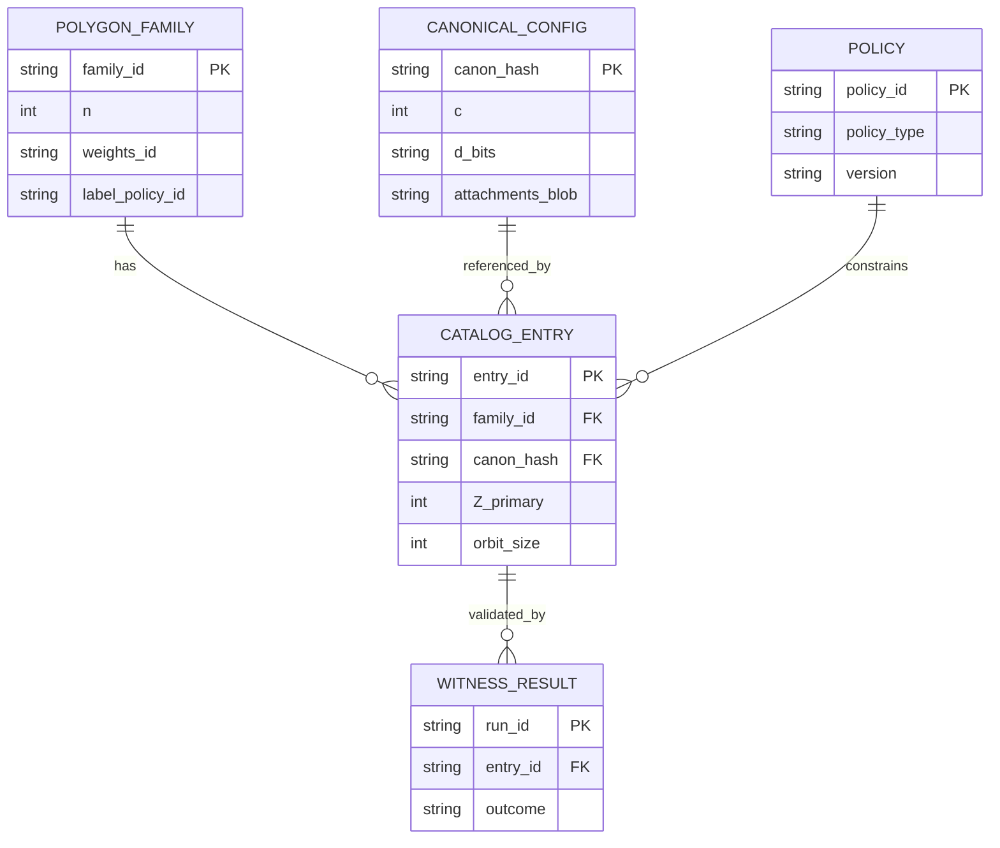

# Duotronics as the Representation and Symbol Layer for OWAC-MQP

## Executive summary

Enabled connectors consulted for this research: **GitHub** and **Hugging Face**.

This section specifies **Duotronics** as the **representation/symbol layer** inside OWAC-MQP (One-Way Audio Control & Media Queue Protocol). The design goal is **aerospace-grade determinism**: the receiver must be able to canonicalize, hash, and verify a sender’s intended command transcript **without ambiguity**, so that any interference, manipulation, or “parser creativity” becomes a **hard reject** at the receiver. This aligns with OWAC-MQP’s “tamper ⇒ invalid” philosophy and its fail-closed stance.

Duotronics contributes three high-leverage properties to OWAC-MQP: determinism under symmetry, strong canonical identity beyond “a single label integer,” and gate-based rejection rather than interpretation. Deterministic serialization is anchored to standards for canonicalization such as **RFC 8785 (JSON Canonicalization Scheme, JCS)**, which explicitly targets producing “hashable” JSON for cryptographic methods. citeturn2search4 For binary protocols, deterministic CBOR encoding is supported by **RFC 8949**’s deterministic encoding requirements (e.g., sorted map keys, preferred/shortest encodings). citeturn2search1turn6search0

For message authenticity binding, OWAC-MQP can sign the canonical Duotronics transcript using NIST’s finalized post-quantum signature standards: **FIPS 204 (ML-DSA)** and/or **FIPS 205 (SLH-DSA)**. citeturn5search0turn2search2turn5search1 These standards were finalized alongside FIPS 203 in August 2024 as NIST’s first set of post-quantum cryptography standards. citeturn5search1turn5search4

The remainder of this document provides: a formal model of polygon configurations and symmetry actions; canonicalization and canonical hashing; descriptor tuples; deterministic algorithms with gates; cryptographic binding and replay defense; validation strategy and performance notes; and worked end-to-end examples including mermaid diagrams.

## Role of the Duotronics representation layer in OWAC-MQP

In OWAC-MQP’s layered stack (physical → link/signal → message/auth → application), Duotronics belongs in a **symbol/representation layer** that can be placed either:

- as an internal sublayer of the **message/auth** layer (Duotronics outputs become the signed “transcript”), or
- as an intermediate layer between **link framing** and **message/auth**, where decoded symbols are canonicalized and then authenticated.

The practical purpose is not “to be exotic math,” but to enforce **deterministic meaning** under declared symmetry and declared policies, so that:
- The receiver can mechanically decide whether two representations are equivalent (symmetry quotienting and canonicalization).
- Any deviation (noise, injection, partial replay, clipping distortion that changes the decoded symbol stream) changes the canonical transcript and therefore fails the integrity/authenticity checks.
- The system never has to “guess” which interpretation to execute; instead it either matches a valid canonical transcript or rejects.

This mirrors well-established needs in cryptographic systems: signing and hashing require that data be rendered in a **stable, invariant** format to avoid “same meaning, different bytes” failure and ambiguity attacks. RFC 8785 explicitly motivates canonicalization for hashable + signable JSON outputs. citeturn2search4 RFC 8949 similarly defines deterministic encoding choices for CBOR, including sorted map keys and preferred/shortest forms, to eliminate encoding ambiguity. citeturn6search0turn2search1

Finally, Duotronics is also compatible with “catalog-driven” recognition and lookup. That is conceptually adjacent to **geometric hashing** as used in recognition: precompute stable features → store in a hash table → recognize by matching features under transformations, as described by Lamdan & Wolfson’s geometric hashing framework in model-based recognition. citeturn3search5 Here, “transformations” are principally symmetry actions on polygons rather than camera motion or affine transforms, but the architectural pattern is the same: **invariants + indexing + fast reject**.

## Formal definition of Duotronics for protocol use

This section defines Duotronics rigorously as a **formal language of polygon cell configurations** with explicit symmetry reduction, canonical identity construction, and typed descriptors suitable for serialization and signing.

### Core objects and open parameters

Duotronics-as-protocol requires fixing the following open parameters (intentionally configurable, but each must be declared and versioned in-protocol):

- Polygon size(s) `n` (e.g., a family may fix `n=6` for hex, or define several `n` families).
- Vertex weight vector `w ∈ ℤ^n` and center weight `w_c ∈ ℤ` (typically `w_c=1`).
- Dot alphabet(s): baseline binary dots `d_k ∈ {0,1}`, center dot `c ∈ {0,1}`; optional extensions allow multi-valued, signed, or attached features.
- Symmetry policy: rotations only (`C_n`) vs rotations + reflections (`D_n`).
- Canonicalization policy: ordering rules and tie-breakers.
- Label mapping policy: modular base rules, offsets, and display/semantic separation.

### Domain: polygon cell configurations

Let `n ≥ 3` be the number of polygon vertices.

A **polygon cell configuration** (baseline dialect) is:

- Center dot indicator `c ∈ {0,1}`
- Vertex dot vector `d = (d_0, d_1, …, d_{n−1})` with `d_k ∈ {0,1}`
- Optional attachments `a` (edges, directions, amplitudes, timestamps) living in a declared attachment space `𝒜` (open parameter)

So the configuration space is:

\[
\mathcal{X}_{n} \;=\; \{0,1\}\times\{0,1\}^{n}\times\mathcal{A}.
\]

### Symmetry group actions

Let `G` be the chosen symmetry group:

- Rotation-only: `G = C_n`, with elements corresponding to shifts `r^t` for `t ∈ {0,…,n−1}`
- Rotation + reflection: `G = D_n`, with `2n` elements (rotations plus reflections)

The group action on a configuration `x=(c,d,a)` acts on the vertex indices and any index-dependent attachments:

- Center dot `c` is fixed
- Vertex vector transforms by permutation
- Attachments transform according to declared rules (must be explicit for determinism)

For rotation by `t`:

\[
(r^{t}\cdot d)_k = d_{(k-t)\bmod n}.
\]

For a reflection `s` (one must define which reflection convention applies, e.g., `k ↦ (-k) mod n`):

\[
(s\cdot d)_k = d_{(-k)\bmod n}.
\]

**Equivalence relation.** Two configurations are symmetry-equivalent if:

\[
x \sim y \quad \Leftrightarrow\quad \exists g\in G:\; g\cdot x = y.
\]

### Symmetry quotienting and orbit size

The orbit of configuration `x` is:

\[
\mathrm{Orb}(x) = \{g\cdot x : g\in G\}.
\]

Orbit size relates to stabilizer size via:

\[
|\mathrm{Orb}(x)| = \frac{|G|}{|\mathrm{Stab}(x)|},\quad \mathrm{Stab}(x)=\{g\in G: g\cdot x=x\}.
\]

Orbit size is a valuable descriptor field because it permits:
- detecting symmetrical “self-equivalences” (nontrivial stabilizers),
- distinguishing distinct canonical forms even if a coarse label `Z_primary` collides.

### Raw sum, weight vectors, and label policies

Define integer weights:

- center weight `w_c ∈ ℤ`
- vertex weights `w = (w_0, …, w_{n−1}) ∈ ℤ^n`

Define raw sum:

\[
S(d,c; w, w_c) = c\cdot w_c + \sum_{k=0}^{n-1} d_k \, w_k.
\]

Define a **label mapping policy** `Π_label`, which maps `S` to a primary label:

- Optional offset `o ∈ ℤ`
- Optional modulus `M ∈ \mathbb{N}`

Two common classes:

\[
Z_{\mathrm{primary}} = S + o \quad\text{(no modulus)}
\]
\[
Z_{\mathrm{primary}} = (S + o)\bmod M \quad\text{(modded label)}
\]

For OWAC-MQP, the protocol must treat `Π_label` as a **declared policy ID**, not an implicit convention, because otherwise “label drift” becomes a parsing ambiguity hazard.

### Descriptor tuple

Duotronics’ reliability as a protocol symbol layer comes from using a **descriptor tuple** rather than relying on `Z_primary` alone.

A recommended minimal descriptor:

| Field | Type | Meaning | Gate-critical invariants |
|---|---:|---|---|
| `Z_primary` | int | Primary label from `Π_label` | Must match recomputed value from canonical config |
| `family_id` | string | Identifies polygon family & weight policy | Must match a known allow-listed family |
| `canon_hash` | bytes/hex | Canonical transcript hash | Must match recomputed hash |
| `parity_bit` | bit | Example: `S mod 2` or other declared parity | Must match declared parity definition |
| `dot_count` | int | `c + Σ d_k` for baseline | Must match canonical config |
| `orbit_size` | int | Size of symmetry orbit under chosen `G` | Must match enumerated orbit |
| `optional_moments` | object | Additional invariants (e.g., weighted sums, run-length motifs) | If present, must validate or be absent |

## Canonicalization, hashing, and descriptor tuple

Canonicalization and hashing are where a “pretty encoding” becomes a **cryptographically bindable transcript**.

### Canonicalization operator

Define a deterministic operator:

\[
\mathrm{Can}:\mathcal{X}_n \to \mathcal{X}_n
\]

such that:

1. **Idempotence:** `Can(Can(x)) = Can(x)`
2. **Invariance:** for all `g ∈ G`, `Can(g·x) = Can(x)`
3. **Total and deterministic:** for each input, returns exactly one canonical representative.

A typical canonicalization rule is: enumerate all symmetry transforms of `(c,d,a)` (within the declared `G`), encode each transformed representation in a deterministic comparison form, and select the **minimum** under a declared ordering (e.g., lexicographic on `d_bits` and then attachments).

This is directly analogous to canonicalization and canonical labeling disciplines in graph isomorphism tooling: canonical labeling reduces objects up to symmetry/isomorphism to a unique representative, enabling stable hashing and comparison. Practical canonical labeling is a core topic in graph isomorphism work such as McKay & Piperno’s “Practical graph isomorphism, II” (nauty/Traces). citeturn3search1turn3search0

### Canonical hash construction

A canonical hash must be a function of **policy + canonical content**, not just content. In OWAC-MQP, policy is part of the security boundary: if policy changes, the receiver must not interpret an old message “as if” it were new.

The hash pipeline must therefore:

1. Construct a canonical **transcript object** containing:
   - schema version
   - `family_id`
   - symmetry policy and canonicalization algorithm IDs
   - label policy IDs
   - canonicalized configuration fields
   - derived metrics like `S`, `Z_primary`, `orbit_size`, etc.
2. Deterministically serialize that object.
3. Hash the serialized bytes with a cryptographic hash (open parameter; typically SHA-256).

Two standards-backed deterministic serialization options:

- **JCS / RFC 8785** for JSON canonicalization (deterministic property sorting + strict number/string handling for “hashable” JSON). citeturn2search4  
- **Deterministically encoded CBOR** per RFC 8949 Section 4.2 (sorted map keys by deterministic encodings; preferred/shortest forms; rules that eliminate multiple encodings for the same data model). citeturn6search0turn2search1

If JSON is used, OWAC-MQP should constrain the JSON domain to an interoperable subset such as **I-JSON** (RFC 7493) to reduce cross-implementation divergence (e.g., about unicode normalization and numbers) and to support deterministic processing. citeturn7search1turn2search4

## Deterministic algorithms and gate checks

### Deterministic canonicalization pseudocode

Below is a reference canonicalization procedure for baseline binary vertex dots and optional dihedral equivalence. This is written for clarity and auditability; performance optimizations are discussed later.

```pseudo
# Inputs:
#   c: {0,1}
#   d[0..n-1]: {0,1}^n
#   a: attachments (optional; may be empty)
#   G_policy ∈ {"C_n", "D_n"}
#   canon_order_policy: total ordering over rendered representations

function APPLY_ROTATION(d, t):
    return d_rot where d_rot[k] = d[(k - t) mod n]

function APPLY_REFLECTION(d):
    return d_ref where d_ref[k] = d[(-k) mod n]  # must match declared convention

function RENDER_FOR_COMPARE(c, d, a):
    # Deterministic, policy-versioned. Example:
    # tuple = (c, d_bits_as_string, canonical_attachment_encoding)
    return tuple

function CANONICALIZE(c, d, a, G_policy):
    candidates = empty list

    # rotations
    for t in 0..n-1:
        d1 = APPLY_ROTATION(d, t)
        a1 = TRANSFORM_ATTACHMENTS(a, rotation=t)  # MUST be deterministic
        candidates.append( (c, d1, a1) )

    if G_policy == "D_n":
        d_ref = APPLY_REFLECTION(d)
        a_ref = TRANSFORM_ATTACHMENTS(a, reflection=true)
        for t in 0..n-1:
            d2 = APPLY_ROTATION(d_ref, t)
            a2 = TRANSFORM_ATTACHMENTS(a_ref, rotation=t)
            candidates.append( (c, d2, a2) )

    # select canonical representative under declared ordering
    best = argmin_{x in candidates} RENDER_FOR_COMPARE(x.c, x.d, x.a)

    # compute orbit_size as number of distinct rendered forms under group
    orbit_set = set( RENDER_FOR_COMPARE(x.c, x.d, x.a) for x in candidates )
    orbit_size = size(orbit_set)

    return best.c, best.d, best.a, orbit_size
```

### Degeneracy tests and ambiguity rejection

OWAC-MQP should treat the following as **hard gates** (reject the message):

- **Canonicalization invariance failure:** `Can(x) != Can(g·x)` for some `g` (indicates non-determinism or implementation bug).
- **Descriptor mismatch:** `Z_primary`, `parity_bit`, `dot_count`, or `orbit_size` do not match recomputed values from canonical config.
- **Policy mismatch:** unknown `family_id`, unknown `canon_alg_id`, unknown `symmetry_policy_id`, or unknown `label_policy_id`.
- **Degeneracy ambiguity:** the received descriptor is not sufficient to uniquely identify the intended semantic symbol in the receiver’s catalog (e.g., only `Z_primary` is present but `Z_primary` is known to be degenerate).

Degeneracy detection itself is catalog-driven:

- **Label degeneracy**: multiple canonical configs map to the same `Z_primary`.  
- **Symmetry degeneracy**: large stabilizer group reduces orbit size (informational, not necessarily invalid).  
- **Schema/policy degeneracy**: a message could be interpreted under multiple historical policies—this must be prevented by explicit policy IDs in the transcript.

### Deterministic minimum-rotation optimization

For large `n`, enumerating all `n` rotations is still cheap for typical OWAC-MQP command surfaces, but if you need extreme throughput, you can use known linear-time algorithms for minimal circular strings:

- Shiloach’s “Fast canonization of circular strings” (minimal representation / minimal starting points). citeturn4search3  
- Duval’s Lyndon factorization approach, which can be applied to least circular shift. citeturn4search1turn4search2  

These references are valuable not because OWAC-MQP needs maximum performance, but because they provide **auditable, mathematically grounded** canonicalization methods that avoid “homebrew” tie-breakers.

### Canonicalization flow diagram

```mermaid
flowchart TD
  A[Decoded symbol payload\n(c, d, a)] --> B[Validate schema + policy IDs]
  B -->|ok| C[Enumerate symmetry transforms\n(G = Cn or Dn)]
  B -->|fail| X[Reject + log reason]

  C --> D[Canonical representative selection\n(argmin under total order)]
  D --> E[Derive metrics\nS, Z_primary, parity, dot_count]
  E --> F[Deterministic serialization\nJCS (RFC 8785) or dCBOR (RFC 8949)]
  F --> G[Hash canonical transcript\n(e.g., SHA-256)]
  G --> H[Verify authenticity binding\n(PQ signature / one-time MAC)]
  H -->|pass| I[Release typed command to OWAC allow-list]
  H -->|fail| X
```

## Security binding to OWAC-MQP authenticity and replay control

### Canonical transcript as the security boundary

OWAC-MQP should never sign “raw audio” or “decoded-but-not-canonicalized symbols.” Instead, the security target is the **canonical transcript**:

- canonicalized configuration (`c`, `d`, `a`)
- explicit policy IDs (family, symmetry policy, canonicalization policy, label policy)
- derived metrics (`S`, `Z_primary`, etc.) treated as redundant checks
- application typed payload (e.g., “QueueTrack(track_id=…)”, “SetRate(r=…)”)

This aligns precisely with the motivation in RFC 8785: canonicalization is used so cryptographic hashing/signing operates on a unique, repeatable representation. citeturn2search4

### Post-quantum signatures

For “state-changing commands,” OWAC-MQP can bind the canonical transcript to a **post-quantum signature**:

- **FIPS 204 (ML-DSA)** as primary PQ signature standard. citeturn5search0turn5search6  
- **FIPS 205 (SLH-DSA)** as a second PQ signature standard; the NIST news release describes SLH-DSA as a backup signature approach using a different method, based on SPHINCS+. citeturn5search1turn2search2  

These were finalized in August 2024 as part of NIST’s initial PQC FIPS set. citeturn5search4turn5search1

### One-time authenticity material

If OWAC-MQP uses a finite pool of pre-shared one-time material (to emphasize “tamper-evident even without hardness assumptions”), the canonical transcript is still the payload. The receiver verifies a one-time MAC/tag over:

- `MID || transcript_hash || context`

and rejects if:
- the one-time key ID was already consumed,
- the counter is out of the allowed window,
- the tag fails.

### Replay-resistant MID binding

Because the channel is one-way, “freshness” cannot be negotiated. The replay defense must therefore be receiver-enforced.

Define a **Message ID (MID)** structure, for example:

- `epoch_id`: identifies the current catalog/policy epoch
- `sender_key_id`: identifies which signing key or one-time pool applies
- `ctr`: monotonic counter
- optional `time_bucket`: coarse time bucket if you want an additional constraint

The authenticity check signs or MACs at least:

\[
\text{AuthPayload} = \text{Encode}(MID) \,\|\, H(\text{CanonicalTranscript}) \,\|\, \text{Context}
\]

Receiver rules:

- `epoch_id` must match active epoch or an explicitly allowed overlap set (migration window), else reject.
- `ctr` must be within monotonic constraints:
  - strictly increasing if single-stream, or
  - within a sliding window if out-of-order is possible in the audio decoding path (generally avoid out-of-order at this layer).

### Failure modes and fail-closed behavior

OWAC-MQP should treat these as **security-significant** failures:

- Canonicalization mismatch across implementations → reject and flag as “software divergence” (unsafe to proceed).
- Serialization mismatch (e.g., JSON float formatting differences) → reject; enforce I-JSON / RFC 7493 constraints and avoid floats in signed content. citeturn7search1
- Signature verification failure → reject and log as authenticity failure (potential interference or injection attempt).
- Policy drift (unknown family/policy IDs) → reject; do not “best effort” interpret, because ambiguity becomes the attacker’s surface.

## Validation, implementation, and performance notes

### Validation and test suite structure

An aerospace-grade posture means **evidence-driven correctness**, not “it worked once.” The test suite should include:

- **Unit invariants** (hard fail):
  - Canonicalization idempotence: `Can(Can(x)) == Can(x)`
  - Canonicalization invariance: `Can(g·x) == Can(x)` for sampled `g ∈ G`
  - Descriptor recomputation: `Z_primary`, `S`, parity, dot_count, orbit_size match recomputation
  - Deterministic serialization byte-exact match against golden vectors (JCS, dCBOR) citeturn2search4turn6search0
- **Differential testing** (hard fail):
  - Two independent implementations produce identical canonical transcripts and hashes for large random samples.
- **Statistical checks** (thresholded):
  - Degeneracy rate by `family_id` and `Π_label` stays within expected bands; sudden shifts indicate policy drift or bug.
- **Fuzz testing** (hard fail when invariant violated):
  - Random malformed attachments or undefined policy IDs must be rejected; never coerced.

### Storage/catalog design

OWAC-MQP needs a **catalog** to map Duotronics descriptors to semantic symbols and allowed actions. This catalog is also where degeneracy is managed.

A minimal entity view (table form as requested):

| Entity | Key fields | Relationships |
|---|---|---|
| `PolygonFamily` | `family_id`, `n`, `weights`, `label_policy_id` | 1→many with `CatalogEntry` |
| `Policy` | `policy_id`, `type` (`symmetry`, `canonicalization`, `label`, `serialization`) | referenced by `CatalogEntry` and transcripts |
| `CanonicalConfig` | `canon_hash`, `c`, `d_bits`, `attachments` | 1→1 or many with `CatalogEntry` (depending on your schema) |
| `CatalogEntry` | `entry_id`, `family_id`, `canon_hash`, `Z_primary`, `orbit_size` | many→1 to `PolygonFamily`; many→1 to `CanonicalConfig` |
| `ZIndex` | `Z_primary`, `family_id` → list of `entry_id` | supports degeneracy detection |
| `WitnessResult` | `run_id`, `entry_id`, gate outcomes | ties protocol symbols to evidence |

Optional: represent this directly in mermaid.



### Numeric stability and floating point handling

For protocol symbol layers, avoid floats in security-relevant fields whenever possible. If floats are unavoidable (e.g., analog-valued attachment parameters), you must declare a **quantization + rounding policy** and treat it as a versioned policy ID. Deterministic encodings like CBOR require careful handling of numeric representations (e.g., shortest float that preserves value in deterministic encoding rules). citeturn6search0turn2search1

If JSON is used, constrain to **I-JSON** to maximize interoperability and avoid edge-case behaviors that can diverge between parsers. citeturn7search1turn2search4

### Performance estimates

Performance is generally not the bottleneck at the Duotronics layer in OWAC-MQP; audio decoding and cryptographic verification typically dominate. Still, we can bound costs for auditability:

| Component | Typical complexity | Notes |
|---|---:|---|
| Canonicalization by enumeration | `O(|G|·n)` compare operations | `|G|=n` for `C_n`, `2n` for `D_n` |
| Orbit-size computation | `O(|G|·n)` | Can reuse rendered candidates |
| Minimal rotation optimization | `O(n)` | Shiloach/Booth/Duval class algorithms apply to circular strings. citeturn4search3turn4search1 |
| Deterministic serialization | `O(L)` | `L` is message size; JCS/dCBOR are linear |
| Hash | `O(L)` | Choose a standard hash; L small |
| PQ signature verify | dominates | NIST PQ signatures are heavier than hashing; ML-DSA/SLH-DSA verification cost is significant but acceptable for low-rate control. citeturn5search0turn2search2 |

## Worked examples and diagrams

### Worked numeric example with canonicalization

**Open parameters (example only):**
- Polygon: hex (`n=6`)
- Symmetry policy: `C6` (rotations only)
- Weights: `w_c=1`, vertex weights `w=[2,4,6,8,10,12]` (example aligns with an “even weights + center toggles parity” style)
- Label policy: `Z_primary = S − 1` (subtract-one offset)

**Input configuration (before canonicalization):**
- center `c=1`
- vertex dots `d = 1 0 1 0 0 0` (vertex indices 0..5)

ASCII sketch (conceptual):

```
          v2●
      v3○     v1○
         \   /
          (●)   center dot = ●
         /   \
      v4○     v0●
          v5○
```

Compute raw sum:

\[
S = 1\cdot 1 + (1\cdot 2) + (1\cdot 6) = 9
\]

Primary label (subtract-one policy):

\[
Z_{\mathrm{primary}} = S - 1 = 8
\]

Dot count:

\[
\mathrm{dot\_count} = c + \sum d_k = 1 + 2 = 3
\]

Canonicalization under `C6` chooses the lexicographically minimal rotation of the vertex bitstring. For `d_bits="101000"`, the minimal rotation is `"000101"` (example canonicalization strategy consistent with “minimal circular string” canonicalization approaches; circular string canonization is a known subject with efficient algorithms). citeturn4search3

Orbit size under `C6` in this example is 6 (no nontrivial stabilizer).

### Canonical transcript and canonical hash example

Below is an example canonical transcript (JSON form). If using JSON canonicalization (RFC 8785 JCS), the receiver canonicalizes the JSON (sorted keys, standardized formatting) prior to hashing/signing. citeturn2search4

```json
{
  "canonicalization_alg": "lexmin_rotation_v1",
  "config": { "c": 1, "d_bits": "000101" },
  "duo_schema": "duo/owac-mqp-duo-0.1",
  "family_id": "hex6_evenweights_v1",
  "metrics": {
    "S": 9,
    "Z_primary": 8,
    "dot_count": 3,
    "orbit_size": 6,
    "parity_bit": 1
  },
  "offset_policy": { "modulus": null, "type": "subtract", "value": 1 },
  "symmetry_group": "C6",
  "weights": { "w": [2, 4, 6, 8, 10, 12], "w_c": 1 }
}
```

If we hash the canonicalized JSON bytes with SHA-256, the example digest is:

`1bed5fe006f2e269562d608b20f956898feab9cb2189143582bdeb48c7468144`

(That digest is included as an illustration of an end-to-end reproducible “canon → serialize → hash” pipeline; OWAC-MQP is free to choose a different hash algorithm, but it must be consistent and versioned.)

### End-to-end example: polygon → canonical transcript → signature verification

This example shows the security binding path for an OWAC-MQP command, assuming PQ signatures:

1. **Decode** audio into a candidate Duotronics symbol payload `(c,d,a)` and associated OWAC typed action payload (e.g., `QueueTrack(track_id=73421, play_mode="soon")`).
2. **Canonicalize** `(c,d,a)` under declared symmetry `G` and produce descriptor fields (`orbit_size`, `dot_count`, etc.).
3. **Construct canonical transcript** including:
   - `MID` (epoch + counter + key ID)
   - `family_id`, policy IDs, canonical config
   - typed action payload (strict allow-list schema)
4. **Deterministically serialize** transcript (JCS or deterministic CBOR). RFC 8785 is designed to produce canonical JSON that is suitable for hashing and signing. citeturn2search4
5. **Hash** transcript bytes.
6. **Verify signature**:
   - If using **FIPS 204 ML-DSA** verify, use the receiver-pinned public key. citeturn5search0  
   - If using **FIPS 205 SLH-DSA** verify, verify under SLH-DSA as specified in FIPS 205. citeturn2search2turn5search1
7. **Replay check**: validate `MID.ctr` and `MID.epoch_id` against receiver state; reject if replay/out-of-window.
8. **Release** the command to OWAC’s allow-listed executor only if all gates pass.

Why this is robust against tampering: any interference that changes decoded `(c,d,a)` changes the canonical transcript bytes and invalidates the signature; any attempt to exploit symmetry ambiguity is preempted by canonicalization; and any attempt to exploit encoding ambiguity is preempted by deterministic serialization (RFC 8785 / RFC 8949). citeturn2search4turn6search0

### Note on evidence and canonical labeling literature

Canonicalization here is “small symmetry group canonicalization,” but it is philosophically aligned with canonical labeling in graph isomorphism: compute a stable representative under equivalence to enable hashing and comparison. McKay & Piperno’s work (nauty/Traces) is a widely cited reference point for practical canonical labeling and automorphism handling. citeturn3search1turn3search0

And the catalog/lookup workflow (precompute descriptors and hash-keys for recognition) is structurally similar to the recognition viewpoint in geometric hashing (Lamdan & Wolfson), reinforcing the architecture’s emphasis on invariants and fast rejection over heuristic interpretation. citeturn3search5